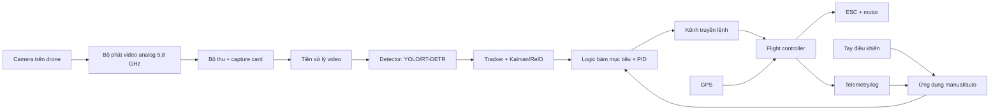
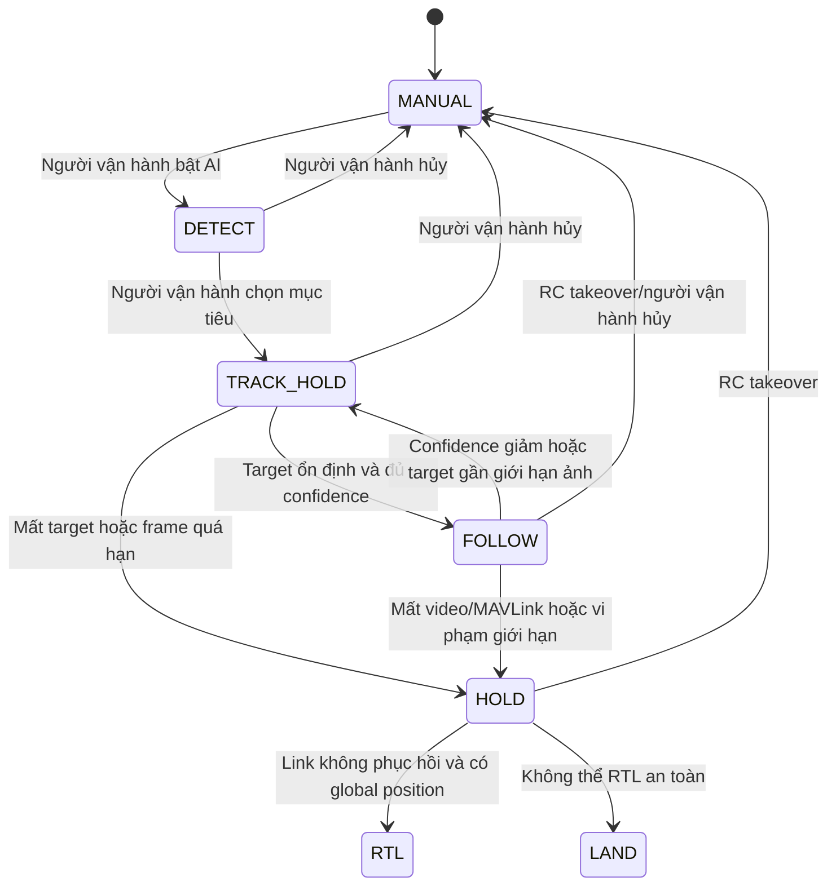

# Báo cáo phân tích video: Bộ nâng cấp drone tự hành giá thấp

## 1. Thông tin tài liệu

- Video phân tích: [Mình Làm Lại Drone Quân Sự Giá 1 Tỷ Với Vài Triệu Bạc](https://www.youtube.com/watch?v=9vU-yUJEl9U)
- Kênh: Trung Tàu Lửa Replay
- Thời lượng: khoảng 19 phút 25 giây
- Mục đích báo cáo: ghi lại chi tiết những gì nhóm trong video đã nghiên cứu, chế tạo và trình diễn; chỉ ra phần nào đã được chứng minh, phần nào mới là tuyên bố; tạo cơ sở để lập kế hoạch phát triển một phiên bản dân dụng an toàn trên nền tảng S500.
- Phạm vi đề xuất cho S500: nhận diện, theo dõi mục tiêu do người vận hành lựa chọn, bay theo ở khoảng cách an toàn, khảo sát và giao vật tư cứu hộ.

> **Giới hạn an toàn:** Video có một phần mô tả chế độ “tương tác vật lý”, trong đó drone tiếp tục tiếp cận mục tiêu. Báo cáo chỉ ghi nhận phần này để đánh giá đầy đủ nội dung video. Hạng mục đó không thuộc phạm vi triển khai. Phiên bản S500 phải duy trì khoảng cách an toàn, có geofence, giới hạn tốc độ, quyền can thiệp của người lái và hành vi an toàn khi mất mục tiêu hoặc mất liên kết.

---

## 2. Kết luận điều hành

Video không chứng minh việc chế tạo một sản phẩm tương đương hoàn toàn với drone quân sự trị giá khoảng 1 tỷ đồng. Thành quả thực tế là một **prototype bộ nâng cấp phần cứng và phần mềm** cho drone phổ thông, gồm:

1. Một drone đa cánh có thể bay và nhận lệnh điều khiển.
2. Camera và đường truyền video từ drone về máy tính mặt đất.
3. Máy tính mặt đất chạy nhận diện đối tượng bằng AI.
4. Phần mềm cho phép điều khiển thủ công hoặc chuyển sang chế độ tự động.
5. Logic biến sai lệch vị trí của mục tiêu trong ảnh thành lệnh chuyển động của drone.
6. Chức năng bay theo người ở khoảng cách đặt trước.
7. Bộ điều khiển PID để giảm giật và dao động khi đổi hướng.
8. Cơ cấu mang, thả hoặc hạ vật tư gần vị trí cần giao.
9. Một số thử nghiệm lọc và duy trì mục tiêu khi chuyển động hoặc bị che khuất.

Ý tưởng quan trọng nhất của video là **chuyển máy tính xử lý AI khỏi drone xuống trạm mặt đất**. Cách này giảm khối lượng, điện năng và giá phần cứng trên máy bay, nhưng khiến chức năng tự hành phụ thuộc vào đường truyền video và đường truyền lệnh.

Đối với dự án S500 hiện tại, nền tảng khung bay, Pixhawk/PX4, GPS, optical flow, rangefinder, mô phỏng Gazebo, Mission và RTL đã có. Các khối còn thiếu chủ yếu là camera trước, mô phỏng mục tiêu, pipeline AI/tracking, kênh MAVLink Offboard, safety supervisor và giao diện chọn mục tiêu.

---

## 3. Sản phẩm tham chiếu trong video

Khoảng `02:25`, video nhắc tới sản phẩm của Anduril có tên gần với **Bolt-M**. Theo thông tin chính thức của nhà sản xuất, dòng Bolt có hai định hướng:

- Bolt: quan sát, trinh sát và tìm kiếm cứu nạn.
- Bolt-M: biến thể mang tải trọng quân sự.

Video lấy cảm hứng từ các khả năng sau:

- tìm kiếm mục tiêu trong khu vực rộng;
- cho người vận hành lựa chọn mục tiêu;
- duy trì khóa mục tiêu;
- theo dõi mục tiêu chuyển động;
- giữ một khoảng cách định trước;
- chống mất dấu khi mục tiêu bị che khuất;
- cập nhật quỹ đạo theo thời gian thực.

Sản phẩm thật sử dụng xử lý AI trên máy bay, camera EO/IR, liên kết chuyên dụng và một hệ thống đã được tích hợp, kiểm thử như sản phẩm hoàn chỉnh. Prototype trong video chỉ tái hiện một phần hành vi ở điều kiện thử nghiệm. Vì vậy, phép so sánh “1 tỷ đồng” và “vài triệu đồng” chỉ phù hợp ở mức ý tưởng/chức năng, không phải so sánh tương đương về năng lực, độ tin cậy hoặc mức độ hoàn thiện.

Nguồn tham khảo: [Anduril Bolt](https://www.anduril.com/bolt), [Anduril giới thiệu Bolt và Bolt-M](https://www.anduril.com/news/anduril-unveils-bolt-and-bolt-m).

---

## 4. Phân tích chi tiết theo dòng thời gian

### 4.1. Giới thiệu bài toán — `00:00–01:30`

Video đặt mục tiêu tạo một hệ thống drone có các chức năng thông minh với chi phí dễ tiếp cận hơn. Mức giá khoảng 40.000 USD/1 tỷ đồng được nêu trong video như giá tham khảo từ một gói thầu, nhưng video không cung cấp hồ sơ gói thầu hoặc cấu hình sản phẩm để kiểm chứng phép so sánh.

Đầu ra được định hướng không chỉ là một drone bay được, mà là một bộ nâng cấp có thể áp dụng cho drone phổ thông.

### 4.2. Phân rã chức năng — `01:30–04:35`

Nhóm chia hệ thống thành hai cụm chức năng lớn:

#### A. Theo dõi mục tiêu

- Tìm kiếm đối tượng trong hình ảnh.
- Xác định đúng đối tượng cần theo dõi.
- Khóa mục tiêu sau khi người vận hành lựa chọn.
- Theo sát mục tiêu khi mục tiêu tăng/giảm tốc hoặc đổi hướng.
- Giữ khoảng cách tương đối với mục tiêu.
- Hạn chế mất dấu khi mục tiêu đi qua vật cản, bụi cây hoặc bị che khuất tạm thời.

#### B. Tương tác với môi trường

- Xác nhận mục tiêu trước khi chuyển chế độ.
- Phân chia quyền quyết định giữa hệ thống tự động và người vận hành.
- Cập nhật lệnh theo chuyển động mới của mục tiêu.
- Dùng cơ chế xác nhận/khóa để tránh kích hoạt nhầm.

Phần B trong video về sau được minh họa bằng cả giao hàng và một chế độ tiếp cận nguy hiểm. Đối với S500, chỉ giữ lại nhánh giao vật tư/hạ cánh có kiểm soát; loại bỏ hoàn toàn logic tiếp cận không giới hạn khoảng cách.

### 4.3. Tháng 1: học kiến thức nền — `04:35–05:05`

Người thực hiện cho biết bắt đầu gần như không có kiến thức về UAV và dành tháng đầu để nghiên cứu:

- nguyên lý drone đa cánh;
- phần cứng điều khiển bay;
- tài liệu kỹ thuật và bài báo khoa học;
- kinh nghiệm từ các kênh/chuyên gia chế tạo drone.

Video không công bố danh mục tài liệu, mô hình toán hoặc thiết kế hệ thống chi tiết. Đây là giai đoạn thu thập kiến thức, chưa có sản phẩm kiểm chứng.

### 4.4. Tháng 2: lắp drone đầu tiên — `05:05–05:35`

Nhóm tập hợp linh kiện để lắp một drone có thể bay. Video cho thấy nhiều lần hỏng linh kiện và thử nghiệm thất bại trước khi đạt trạng thái bay được.

Những gì có thể kết luận:

- Nhóm đã tự lắp và làm chủ một nền tảng drone đa cánh ở mức prototype.
- Quá trình có thử–sai thực tế, không chỉ mô phỏng.

Những gì không được công bố:

- danh sách linh kiện và mã sản phẩm;
- tổng khối lượng cất cánh;
- motor, ESC, cánh quạt và pin;
- thrust-to-weight ratio;
- thời gian bay và tải trọng hữu ích;
- kết quả hiệu chuẩn, rung động hoặc tuning flight controller.

### 4.5. Tháng 3: kiến trúc máy tính điều khiển — `05:35–07:05`

Video mô tả kiến trúc phổ biến gồm hai máy tính:

1. Flight controller chịu trách nhiệm ổn định và điều khiển động cơ.
2. Companion computer chạy tác vụ nặng như xử lý ảnh và tự lái.

Để giảm giá và khối lượng, nhóm bỏ companion computer trên drone, chuyển xử lý AI xuống máy tính mặt đất và gửi lệnh trở lại qua liên kết không dây.

#### Ưu điểm được nêu

- giảm giá phần cứng trên drone;
- giảm khối lượng;
- giảm tiêu thụ điện;
- tăng thời gian bay tiềm năng;
- máy tính mặt đất có thể mạnh hơn;
- có khả năng mở rộng một máy tính điều phối nhiều drone.

#### Nhược điểm thực tế

- mất video đồng nghĩa AI không còn quan sát được;
- mất kênh lệnh đồng nghĩa chế độ tự động phải dừng;
- độ trễ mạng trực tiếp ảnh hưởng ổn định điều khiển;
- trạm mặt đất trở thành điểm lỗi đơn;
- không có khả năng tự hành độc lập khi mất liên kết;
- cần cơ chế Hold/RTL/Land rõ ràng trên flight controller.

Video có thừa nhận kiến trúc này không phù hợp với môi trường gây nhiễu. Nhóm chuyển mục tiêu sử dụng sang cứu trợ, giao thực phẩm, thuốc hoặc thả phao.

### 4.6. Tháng 4: đường truyền lệnh và video — `07:05–07:55`

Video trình bày hai kênh:

#### Kênh điều khiển

- Nhóm nói đã thử một số công nghệ vô tuyến và chọn LoRa.
- LoRa được mô tả trong video là có tốc độ và băng thông cao.

Mô tả này không chính xác với LoRa truyền thống. LoRa được tối ưu cho tầm xa, công suất thấp và tốc độ dữ liệu thấp. LoRa có thể phù hợp cho telemetry/lệnh mức cao với lưu lượng nhỏ, nhưng không phù hợp để truyền video và cần đánh giá kỹ độ trễ/jitter nếu dùng cho setpoint liên tục.

Nguồn kỹ thuật: [Semtech — LoRa and LoRaWAN Technical Overview](https://lora-developers.semtech.com/uploads/documents/files/LoRa_and_LoRaWAN-A_Tech_Overview-Downloadable.pdf).

#### Kênh video

- Phương án digital qua Wi-Fi công suất lớn được cân nhắc.
- Nhóm chọn video analog 5,8 GHz do rẻ.
- Tín hiệu từ bộ thu được đưa vào máy tính qua capture card.
- Do video analog có chất lượng thấp, nhóm bổ sung bước tiền xử lý ảnh thời gian thực.

Video không công bố:

- độ phân giải và FPS;
- độ trễ camera-to-PC;
- khoảng cách thử nghiệm;
- tỷ lệ mất khung hình;
- ảnh hưởng của nhiễu lên độ chính xác AI.

### 4.7. Chọn mô hình AI — `07:55–09:10`

Chuyên gia trong video đề cập hai họ mô hình phát hiện đối tượng:

- YOLO: nhẹ, phổ biến, độ chính xác tốt và phù hợp xử lý thời gian thực.
- RT-DETR: detector dựa trên Transformer, có thể cho độ chính xác cao hơn trong một số miền dữ liệu.

Các phương án tối ưu được nhắc đến:

- FP16;
- INT8 quantization;
- chọn kiến trúc nhẹ hơn cho thiết bị tài nguyên hạn chế.

Video không công bố bộ dữ liệu huấn luyện, class mục tiêu, số lượng ảnh, cách gán nhãn, precision, recall, mAP hoặc tốc độ suy luận. Vì vậy chỉ có thể kết luận nhóm đã tích hợp một detector hoạt động trong demo, chưa thể đánh giá chất lượng mô hình.

### 4.8. Tháng 5–6: ứng dụng điều khiển — `09:10–10:50`

Ứng dụng được mô tả có hai chế độ:

- điều khiển bằng tay cầm vật lý;
- chuyển sang tự động bằng một thao tác trên giao diện.

Luồng xử lý tự động được mô tả như sau:

1. Camera gửi hình ảnh về PC.
2. AI phát hiện mục tiêu.
3. Phần mềm xác định mục tiêu lệch trái/phải hoặc thay đổi vị trí trong khung hình.
4. Phần mềm tạo lệnh chuyển động tương ứng cho drone.
5. Flight controller nhận lệnh và thực hiện bay.

Nhóm cũng xây cơ chế **soft takeover/synchronization** khi chuyển từ điều khiển tự động về điều khiển tay. Mục tiêu là tránh việc giá trị cần điều khiển vật lý khác xa giá trị mà chế độ tự động đang sử dụng, gây bước nhảy lệnh đột ngột và làm drone giật hoặc mất ổn định.

Đây là một điểm thiết kế có giá trị thực tế. Tuy nhiên video không cho biết:

- giao thức gửi lệnh;
- loại setpoint: vị trí, vận tốc, attitude hay motor output;
- tần số setpoint;
- logic state machine;
- timeout và hành vi khi app bị treo;
- cách RC giành quyền ưu tiên;
- cách chống gửi lệnh cũ.

### 4.9. Sáu tháng thử nghiệm bay — `10:50–12:53`

Video cho biết sáu tháng tiếp theo chủ yếu dành cho bay thử và sửa lỗi.

#### Kết quả trình diễn

- Drone cất cánh và giữ độ cao.
- Ứng dụng nhận hình ảnh và chạy chức năng theo người.
- Drone di chuyển theo bước chân của mục tiêu.
- Chuyến bay tạo được log để xem lại.

#### Lỗi được phát hiện

- Drone giật mạnh khi đổi hướng.
- Chuyển động không mượt dù chức năng theo người đã hoạt động.

#### Cách xử lý

Nhóm sử dụng PID để giảm sai lệch và dao động. Video giải thích đúng ở mức khái niệm: hệ thống so sánh trạng thái hiện tại với mục tiêu và điều chỉnh liên tục dựa trên thành phần hiện tại, tích lũy và xu hướng thay đổi.

Tuy nhiên, video không công bố giá trị PID, mô hình động lực học, tần số vòng điều khiển, latency hoặc đồ thị before/after. Do đó chưa thể xác nhận mức cải thiện định lượng.

### 4.10. Chức năng giao vật tư — `12:53–14:49`

Mục tiêu được đặt ra:

- dùng GPS bay tới vùng tương đối gần người nhận;
- dùng xử lý ảnh để tinh chỉnh vị trí tương đối;
- giao vật tư chính xác hơn so với chỉ dựa vào GPS.

Nhóm gặp lỗi khi thử GPS trong sân nhà, nhưng GPS hoạt động tốt khi chuyển ra khu vực thoáng và bắt được nhiều vệ tinh. Đây là bài học thực tế về che khuất bầu trời, multipath và điều kiện thử GNSS.

Cơ cấu mang hàng được mô tả có hai chế độ:

1. Bay gần mục tiêu rồi thả vật tư.
2. Bay gần mục tiêu, hạ cánh nhẹ nhàng để người nhận tháo vật tư bằng tay.

Video cho thấy đã có một cơ cấu khóa/thả payload, nhưng không công bố:

- tải trọng tối đa;
- ảnh hưởng payload đến CG;
- dòng điện của servo/cơ cấu chấp hành;
- interlock chống thả nhầm;
- độ chính xác giao hàng;
- số lần thử thành công/thất bại;
- tiêu chí xác nhận vùng hạ cánh an toàn.

### 4.11. Theo dõi khi mục tiêu đổi hướng/che khuất — `14:49–17:38`

Video nhắc tới:

- bộ lọc Kalman để làm mượt và dự báo trạng thái;
- Re-Identification (ReID) để hỗ trợ nhận lại mục tiêu;
- cập nhật hướng di chuyển theo thời gian thực.

Nhóm trình diễn một chế độ tiếp cận mục tiêu và thừa nhận chức năng có rủi ro cao. Video nói sẽ đặt mật khẩu/xác nhận nhiều bước và không đưa chức năng này vào bản open-source.

Đối với dự án S500, phần có thể kế thừa chỉ gồm:

- lọc nhiễu bounding box;
- duy trì ID của mục tiêu;
- dự đoán ngắn hạn khi mất hình;
- tái nhận diện sau che khuất;
- quay lại Hold khi độ tin cậy không đủ;
- tiếp tục giữ khoảng cách tối thiểu.

Không kế thừa logic loại bỏ khoảng cách an toàn hoặc tiếp tục lao vào mục tiêu.

### 4.12. Đầu ra cuối video — `18:42–19:25`

Nhóm tuyên bố đầu ra hiện tại là một **bộ kit nâng cấp drone**, bao gồm cả phần cứng và phần mềm, giúp drone bình thường có một số chức năng tự hành thông minh.

Video cũng nói dự án mới hoàn thành giai đoạn 2 trong tổng số 4 giai đoạn. Điều này xác nhận sản phẩm vẫn là prototype đang phát triển, chưa phải hệ thống hoàn chỉnh hoặc sẵn sàng thương mại.

---

## 5. Kiến trúc hệ thống suy ra từ video

### Phân chia trách nhiệm

| Khối | Trách nhiệm |
|---|---|
| Flight controller | Ổn định attitude, độ cao/vị trí, điều khiển motor, failsafe cơ bản |
| Máy tính mặt đất | Nhận video, nhận diện, tracking, quyết định lệnh bay mức cao |
| Ứng dụng điều khiển | Chọn mục tiêu, chuyển manual/auto, hiển thị trạng thái |
| Đường truyền video | Đưa hình ảnh camera về máy tính |
| Đường truyền lệnh | Gửi setpoint/command và nhận telemetry |
| RC độc lập | Giành quyền điều khiển và xử lý khẩn cấp |
| GPS/flow/range | Cung cấp state estimate cho flight controller |

---

## 6. Những gì video đã chứng minh và chưa chứng minh

### 6.1. Đã có bằng chứng trực quan hoặc lời giải thích tương đối rõ

- Tự lắp được drone có khả năng bay.
- Truyền được video về máy tính mặt đất.
- Tích hợp detector AI vào luồng video.
- Có ứng dụng hỗ trợ điều khiển tay và tự động.
- Có chức năng theo người trong điều kiện thử nghiệm.
- Có quá trình đọc log và sửa lỗi điều khiển.
- Đã áp dụng PID để cải thiện chuyển động.
- GPS hoạt động khi thử ở khu vực thoáng.
- Có cơ cấu mang/thả vật tư.
- Có thử nghiệm lọc và duy trì mục tiêu.
- Đầu ra được đóng gói theo hướng kit nâng cấp phần cứng/phần mềm.

### 6.2. Chưa được chứng minh định lượng

- Tầm truyền lệnh và tầm truyền video.
- Thời gian bay.
- Tải trọng tối đa.
- Tốc độ tối đa trong chế độ tự động.
- Độ trễ camera-to-command.
- FPS và độ chính xác AI.
- Khả năng hoạt động ban đêm hoặc trong mưa/gió.
- Tỷ lệ giữ đúng ID qua che khuất.
- Độ chính xác khoảng cách bám.
- Độ chính xác giao hàng.
- Khả năng phục hồi sau mất video, mất telemetry hoặc app crash.
- Khả năng một PC điều khiển nhiều drone.
- Độ bền, chống bụi/nước và rung động.
- Bảo mật đường truyền.
- Tính hợp pháp của toàn bộ cấu hình radio và hoạt động bay.
- Tổng BOM thực tế và chi phí bao gồm các linh kiện đã hỏng.
- Số chuyến bay thử và tỷ lệ thành công.

### 6.3. Không tương đương sản phẩm tham chiếu

| Hạng mục | Prototype trong video | Sản phẩm tham chiếu hoàn chỉnh |
|---|---|---|
| Xử lý AI | Chủ yếu ở máy tính mặt đất | Xử lý tích hợp trên phương tiện |
| Camera | Video analog giá thấp | Hệ camera chuyên dụng, có cấu hình EO/IR |
| Liên kết | Các radio thương mại giá thấp | Liên kết tích hợp và được kiểm thử hệ thống |
| Môi trường | Demo ngoài trời có kiểm soát | Thiết kế cho nhiều điều kiện vận hành |
| Safety | Logic phần mềm ở mức prototype | Safety phần cứng/phần mềm và quy trình vận hành |
| Chứng minh hiệu năng | Không có số liệu đầy đủ | Có thông số sản phẩm và quy trình đánh giá |
| Chi phí | Chủ yếu tính phần cứng prototype | Gồm R&D, kiểm thử, tích hợp, độ bền, hỗ trợ và sản xuất |

---

## 7. Đối chiếu với dự án S500 hiện tại

### 7.1. Tài sản đã có

- Khung S500 500 mm.
- Pixhawk 6C/PX4 v1.17.
- GPS M10 trong cấu hình mô phỏng.
- MTF-01 optical flow và rangefinder hướng xuống.
- Mô hình Gazebo S500.
- PX4 SITL launcher.
- Mission QGroundControl 15 m và 40 m.
- Log các chuyến bay Position, Mission và RTL.
- Phân tích pin, failsafe, RC override và trạng thái estimator.
- Cầu iBUS từ FS-iA6B về PC.

### 7.2. Thành phần còn thiếu để tái hiện phần dân dụng của video

- Camera RGB hướng trước trong mô phỏng.
- Camera và gá chống rung cho drone thật.
- Đối tượng/người mô phỏng có quỹ đạo di chuyển.
- Pipeline nhận video/GStreamer hoặc ROS 2 image topic.
- Detector và tracker.
- Giao diện để người vận hành chọn/khóa mục tiêu.
- Bộ chuyển bounding-box error thành velocity/yaw setpoint.
- MAVSDK hoặc ROS 2 Offboard bridge.
- Safety supervisor và state machine.
- Cơ chế kiểm tra stale frame/stale command.
- Geofence và giới hạn vận tốc/gia tốc.
- Test mất video, mất MAVLink, mất target và app crash.
- Giao diện log, replay và đánh giá KPI.
- Cơ cấu payload an toàn nếu thực hiện nhánh giao vật tư.

### 7.3. Các vấn đề phải xử lý trước khi bay Offboard thật

Theo các báo cáo log hiện có:

- nguồn avionics 5 V từng xuống khoảng 4,65–4,66 V và PX4 phát cảnh báo;
- liên kết GCS từng mất trong các khoảng 51–174 giây;
- một số chuyến bay trước chưa có nghiệm GPS/global tin cậy;
- sai số vị trí local tích lũy EPH từng tăng tới khoảng 3,37–5,96 m;
- đã có tình huống stick override làm Mission chuyển sang Position khi throttle đang ở đáy;
- hệ số động lực trong Gazebo vẫn là giá trị ước lượng, chưa hiệu chuẩn bằng thrust stand và cấu hình airframe thật.

Các điểm này chưa ngăn việc phát triển phần mềm trong SITL, nhưng ngăn việc chuyển thẳng sang thử nghiệm bám mục tiêu trên drone thật.

Tài liệu nội bộ liên quan:

- [`Simulation/gazebo/README.md`](../Simulation/gazebo/README.md)
- [`Simulation/gazebo/models/s500_quad_x/model.sdf`](../Simulation/gazebo/models/s500_quad_x/model.sdf)
- [`Log/flight_log_report.md`](../Log/flight_log_report.md)
- [`Log/bao_cao_06_pin_va_ha_canh.md`](../Log/bao_cao_06_pin_va_ha_canh.md)
- [`MCU/Controller/Controller.ino`](../MCU/Controller/Controller.ino)

---

## 8. Phạm vi chức năng đề xuất cho phiên bản S500

### 8.1. Chức năng bắt buộc cho MVP

1. Hiển thị video trực tiếp.
2. Người vận hành bấm chọn mục tiêu.
3. Detector/tracker duy trì bounding box và target ID.
4. Drone quay yaw để đưa mục tiêu về giữa ảnh.
5. Drone di chuyển ngang/chậm để theo mục tiêu.
6. Duy trì khoảng cách an toàn tối thiểu.
7. Giới hạn tốc độ, gia tốc, độ cao và khu vực bay.
8. RC có quyền ưu tiên giành điều khiển ngay lập tức.
9. Mất mục tiêu: giảm tốc và chuyển Hold.
10. Mất video hoặc lệnh quá hạn: thoát Offboard.
11. Mất liên kết kéo dài: Hold, RTL hoặc Land theo điều kiện định vị.
12. Ghi log video, detection, setpoint, telemetry và sự kiện chuyển mode.

### 8.2. Chức năng có thể làm sau MVP

- ReID sau che khuất.
- Theo dõi nhiều đối tượng nhưng chỉ khóa một mục tiêu do người chọn.
- Hạ cánh trên marker/landing pad.
- Giao vật tư với xác nhận thủ công.
- Chuyển xử lý AI lên companion computer để giảm phụ thuộc liên kết.
- Điều phối nhiều drone ở mức Mission, sau khi một drone đã an toàn và ổn định.

### 8.3. Chức năng loại khỏi phạm vi

- Tự động chọn người làm mục tiêu mà không có xác nhận.
- Tự động tiếp cận con người đến khoảng cách bằng không.
- Điều khiển để va chạm với người, phương tiện hoặc công trình.
- Mang vũ khí, vật liệu nguy hiểm hoặc tải trọng gây hại.
- Vô hiệu hóa RC takeover hoặc bỏ failsafe để duy trì truy đuổi.

---

## 9. State machine an toàn đề xuất

Nguyên tắc quan trọng:

- AI không điều khiển trực tiếp motor.
- AI chỉ phát position/velocity/yaw setpoint có giới hạn.
- PX4 giữ vòng ổn định bay và quyền failsafe cuối cùng.
- Setpoint phải có timestamp và timeout.
- Lệnh cũ không được tiếp tục thực hiện sau khi mất app hoặc mất video.
- Không cho phép chuyển sang Follow nếu chưa xác nhận target và chưa thỏa điều kiện định vị.

PX4 yêu cầu tín hiệu Offboard liên tục lớn hơn 2 Hz để duy trì chế độ. Đối với prototype nên đặt mục tiêu 10–20 Hz, đồng thời cấu hình rõ `COM_OF_LOSS_T` và hành động khi mất Offboard. Nguồn: [PX4 Offboard Mode v1.17](https://docs.px4.io/v1.17/en/flight_modes/offboard).

---

## 10. Chỉ số cần đo khi lập kế hoạch triển khai

### 10.1. Computer vision

- FPS detector.
- FPS tracker.
- End-to-end latency từ camera đến setpoint.
- Precision/recall trên dữ liệu thử thực tế.
- Tỷ lệ giữ đúng ID.
- Thời gian phục hồi target sau che khuất.
- Tỷ lệ false lock.

### 10.2. Điều khiển

- Sai lệch mục tiêu so với tâm ảnh.
- Khoảng cách bám trung bình và cực đại.
- Overshoot khi mục tiêu đổi hướng.
- Gia tốc và jerk của drone.
- Tần số setpoint thực nhận tại PX4.
- Thời gian thoát Offboard khi mất lệnh.

### 10.3. Liên kết

- Packet loss.
- Round-trip time.
- Jitter.
- Khoảng cách hoạt động.
- Video frame loss.
- Thời gian chuyển sang failsafe.

### 10.4. An toàn bay

- Tỷ lệ RC takeover thành công.
- Hành vi khi mất GPS/global position.
- Hành vi khi mất target.
- Hành vi khi app crash.
- Hành vi khi camera đóng băng nhưng kết nối mạng vẫn còn.
- Geofence violation count.
- Pin, nguồn 5 V, CPU, EKF và vibration.

### 10.5. Giao vật tư

- Tải trọng thử nghiệm.
- Sai lệch CG.
- Độ chính xác vị trí thả/hạ.
- Tỷ lệ nhả cơ cấu thành công.
- Cơ chế chống kích hoạt nhầm.
- Khả năng quay về sau khi giao.

---

## 11. Tiêu chí hoàn thành gợi ý cho từng mức

### Mức A — AI offline

- Detector/tracker chạy được trên video đã ghi.
- Người vận hành chọn đúng target.
- Có log confidence, ID và bounding box.
- Không điều khiển drone.

### Mức B — SITL quan sát

- Camera trước trong Gazebo nhìn thấy mục tiêu di chuyển.
- AI phát hiện/tracking thời gian thực.
- Lệnh chỉ hiển thị, chưa gửi tới PX4.

### Mức C — SITL closed-loop

- PX4 SITL nhận velocity/yaw setpoint.
- Drone theo mục tiêu ở khoảng cách an toàn.
- Mất target/video/app đều chuyển Hold/RTL đúng thiết kế.
- RC/joystick takeover hoạt động.

### Mức D — Hardware-in-the-loop/bench

- Pixhawk thật nhận lệnh nhưng tháo cánh quạt.
- Kiểm thử mất kết nối và stale command.
- Xác nhận không có bước nhảy lệnh khi chuyển Auto/Manual.

### Mức E — Bay thật giới hạn

- Khu vực thử được cấp phép và cách ly.
- Không gắn payload.
- Tốc độ và vùng bay giới hạn.
- Người lái RC luôn sẵn sàng.
- Hoàn thành nhiều chuyến lặp lại không có cảnh báo nguồn, EKF hoặc liên kết.

### Mức F — Giao vật tư thử nghiệm

- Chỉ thực hiện sau khi Mức E đạt yêu cầu.
- Payload nhẹ, vô hại.
- Thả/hạ tại marker hoặc landing pad, không tiếp cận trực tiếp con người.
- Mỗi lần giao phải có xác nhận của người vận hành.

---

## 12. Pháp lý và vận hành tại Việt Nam

S500 mô phỏng hiện có khối lượng khoảng 1,68 kg, nên không thuộc ngoại lệ phương tiện giải trí dưới 0,25 kg. Trước khi bay thật cần kiểm tra ít nhất:

- đăng ký phương tiện;
- điều kiện đối với phương tiện tự lắp ráp/thử nghiệm;
- giấy phép bay hoặc điều kiện miễn trừ cụ thể;
- khu vực cấm bay/hạn chế bay;
- điều kiện người điều khiển;
- tần số vô tuyến và công suất phát;
- quyền riêng tư khi quay và xử lý hình ảnh con người;
- phương án đảm bảo an toàn người và tài sản.

Nguồn pháp lý chính:

- [Luật Phòng không nhân dân số 49/2024/QH15](https://vbpl.vn/botaichinh/Pages/vbpq-print.aspx?ItemID=173624)
- [Nghị định 288/2025/NĐ-CP về quản lý tàu bay không người lái](https://vbpl.vn/TW/Pages/vbpq-toanvan.aspx?ItemID=183413)
- [Công bố khu vực cấm bay, hạn chế bay của Bộ Quốc phòng](https://mod.gov.vn/home/detail/%21ut/p/z1/1VJLU8IwEP4tHjjuJLE8yrGAVB1lREFoLs6SlDZCkxbSqv_etHhRB9GjmUmy-2W_zb4IJ0vCNVYqQauMxq3TI959GgeTe3_AAhp2Jj6dzoZj1mPUCweULD4b0KubIZ2OwllnMrpjNOwR_hs-PbICeor_SDjhQtvcpiTKjGzRPYK7Ya9s3CjW7jcfAhQ56hZdGShKIyBPjU5A1IeDNmkJVSlAYAYrfIMUNYg0bmS7izVIhU5xIIKu6dIoqNy2WDZGm8adTkqHbVE592UNWOW4h3cUdbS5UJJEfezQrkAfvP75GtroS-hT6QOTDIXHPOnH66_V_Z4-_7l4i_q_E_055SNyMfSOxjDukkWl4hcy12aXuYl5-GOKl5RcE55szeowbuq5KHjgemq0jV8tWf6DpubZfJ75ntPWtxdem0fB2dk7V4F_JA%21%21/dz/d5/L2dJQSEvUUt3QS80TmxFL1o2X0ZBTlI4QjFBMEc1TjgwUVRDRjE3MTAzR0Iw/)

---

## 13. Các quyết định cần chốt trước khi lập kế hoạch thực hiện

1. Mục tiêu MVP là theo người, theo phương tiện thử nghiệm hay theo marker?
2. Xử lý AI đặt hoàn toàn ở máy tính mặt đất hay có companion computer dự phòng?
3. Camera và đường truyền video dự kiến là analog, USB/CSI + IP hay camera số chuyên dụng?
4. Kênh MAVLink sử dụng telemetry radio, Wi-Fi hay kết nối khác?
5. PX4 nhận position setpoint hay velocity setpoint?
6. Khoảng cách bám, tốc độ và độ cao giới hạn là bao nhiêu?
7. Hành động khi mất Offboard: Position, Hold, RTL hay Land?
8. Điều kiện nào cho phép chuyển từ Manual sang Follow?
9. Dữ liệu huấn luyện có cần tự thu thập hay dùng detector người có sẵn?
10. Có đưa nhánh giao vật tư vào phiên bản đầu hay để sau khi follow ổn định?
11. Khu vực thử nghiệm hợp pháp và điều kiện cấp phép là gì?
12. KPI nào được dùng để quyết định chuyển từ SITL sang drone thật?

---

## 14. Kết luận cuối

Giá trị lớn nhất của video không nằm ở tuyên bố “drone 1 tỷ với vài triệu”, mà nằm ở cách phân rã bài toán thành các khối có thể phát triển độc lập:

1. nền tảng bay ổn định;
2. truyền video;
3. nhận diện và tracking;
4. điều khiển mức cao;
5. chuyển quyền manual/auto;
6. safety và failsafe;
7. ứng dụng nhiệm vụ như theo người hoặc giao vật tư.

Để thực hiện trên S500, nên giữ kiến trúc flight controller chịu trách nhiệm ổn định và an toàn, còn AI chỉ tạo setpoint mức cao có giới hạn. Thứ tự phát triển phù hợp là **AI offline → camera Gazebo → SITL closed-loop → kiểm thử lỗi → bench/HIL → bay thật giới hạn → giao vật tư**.

Không nên chuyển thẳng từ demo nhận diện sang bay thật. Các cảnh báo nguồn 5 V, mất GCS và độ tin cậy định vị trong log hiện tại phải được xử lý song song trước khi thử Offboard trên phần cứng.
