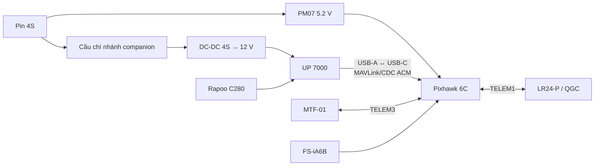
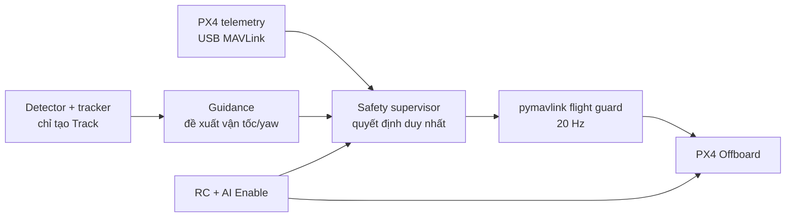
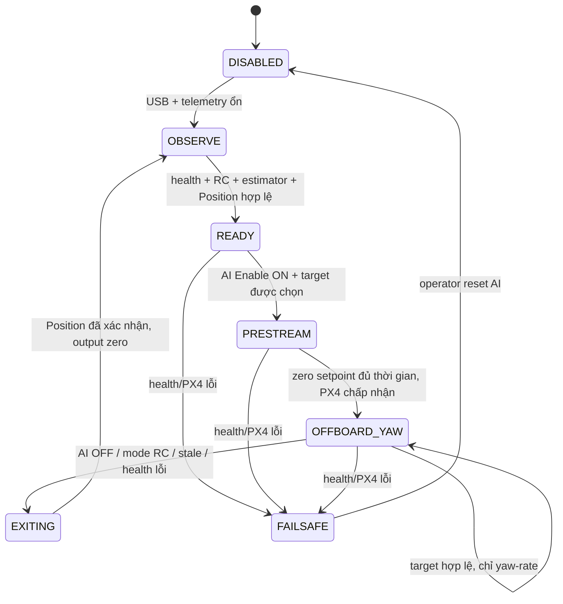

# Kế hoạch điều khiển PX4 từ UP 7000 qua USB trực tiếp

## 1. Mục đích và phạm vi

Tài liệu này là kế hoạch triển khai riêng cho đường điều khiển:

```text
UP 7000 (vision + safety supervisor) ── USB MAVLink ── Pixhawk 6C / PX4
```

Mục tiêu cuối cùng là để UP 7000 **gửi setpoint vận tốc/yaw mức cao** cho PX4 trong chế độ Offboard, phục vụ camera bám mục tiêu đã được người vận hành chọn. Pixhawk vẫn chịu trách nhiệm hoàn toàn về attitude, rate, motor, Mission, RTL, geofence và failsafe. UP 7000 tuyệt đối không ghi lệnh actuator/ESC/motor.

Phạm vi của tài liệu chỉ là liên kết USB, telemetry, lớp an toàn và Offboard. Pipeline detect người do nhóm khác thực hiện được coi là một nguồn dữ liệu đầu vào có timestamp; nó không được cấp quyền điều khiển trực tiếp.

> **Nguyên tắc phát hành:** không tự arm, không tự cất cánh, không theo người tự động trong lần bay đầu. Người lái luôn cất cánh, giữ Position và có quyền rời Offboard ngay bằng RC. Mỗi pha chỉ mở thêm quyền điều khiển sau khi gate của pha trước đã PASS.

## 2. Quyết định kiến trúc đã chốt

| Hạng mục | Quyết định |
|---|---|
| Đường companion | USB trực tiếp từ UP 7000 vào cổng USB-C service của Pixhawk 6C; không dùng UART/TELEM2 cho UP 7000. |
| Cáp | USB-A data (UP 7000) → USB-C data (Pixhawk), ngắn, có strain-relief; không dùng cáp chỉ sạc. |
| Thiết bị Linux | Dùng đường dẫn bền vững `/dev/serial/by-id/...`, không hard-code `/dev/ttyACM0`. |
| Cổng Pixhawk khác | Giữ nguyên TELEM1/LR24-P, TELEM3/MTF-01; không thay parameter MAVLink của hai liên kết này. |
| Nguồn | PM07 tiếp tục nuôi Pixhawk; UP 7000 có nhánh 12 V riêng từ pin qua DC-DC và cầu chì. |
| Luồng lệnh đầu tiên | `body velocity = 0`, sau đó **yaw-rate only**; không mở vận tốc tịnh tiến trong MVP điều khiển đầu tiên. |
| Tần số lệnh | 20 Hz danh định từ process MAVLink; đo P99 gap nhỏ hơn 100 ms. |
| Fallback chủ động | Tắt AI/target stale/link stale → dừng phát setpoint, thoát Offboard về Position và khóa AI. |
| Fallback khi UP chết/rút cáp | PX4 xử lý Offboard-loss theo parameter đã kiểm thử; người lái giữ Position/RTL qua RC. |

PX4 hỗ trợ companion qua USB MAVLink; với hệ Linux, Pixhawk thường hiện như thiết bị CDC ACM (ví dụ `/dev/ttyACM0`). Cổng USB và cổng POWER của Pixhawk 6C có thể cùng tồn tại, trong đó POWER1/POWER2 được ưu tiên so với USB. Xem [PX4 Companion Computer](https://docs.px4.io/main/en/companion_computer/pixhawk_companion), [PX4 MAVLink Shell qua USB](https://docs.px4.io/v1.17/en/debug/mavlink_shell) và [Pixhawk 6C power](https://docs.px4.io/main/en/flight_controller/pixhawk6c).

## 3. Trạng thái nền và những điều không được thay đổi

- S500 đã bay waypoint ổn định với PX4 v1.17 theo log đã kiểm tra.
- `MAV_0_CONFIG=TELEM1`: giữ LR24-P/QGroundControl.
- `MAV_1_CONFIG=TELEM3`: giữ MTF-01 và dây hiện hữu.
- `MAV_2_CONFIG=0`: **giữ nguyên** khi dùng USB; không cần chuyển nó sang TELEM2.
- `COM_RC_OVERRIDE=1`, `COM_OF_LOSS_T=1`: chỉ ghi nhận baseline hiện tại; không sửa để "cho chạy được". Chính sách Offboard-loss sẽ được chứng minh bằng SITL và bench trước khi xem xét thay đổi.
- Không mở 4G thành đường điều khiển. 4G chỉ là UI/video/giám sát; hỏng 4G không được ảnh hưởng vòng USB nội bộ.

Trước mọi thay đổi: export parameter mới nhất, lưu ULog baseline, chụp ảnh sơ đồ dây và ghi hash phiên bản PX4/UP7000/application. Có backup thì rollback phải mất dưới 10 phút.

## 4. Phần cứng, nguồn và cơ khí

### 4.1. Sơ đồ đấu nối



### 4.2. Yêu cầu bắt buộc trước khi cấp nguồn

1. Dùng cáp USB có truyền dữ liệu, ưu tiên 20–50 cm, đầu cắm chắc và có kẹp/đai giữ cáp vào khung. Không để cáp mang lực kéo lên USB-C của Pixhawk.
2. UP 7000 phải được cấp từ nhánh DC-DC 12 V riêng; không lấy nguồn nuôi UP từ TELEM, USB hoặc rail 5 V của Pixhawk.
3. PM07 vẫn cắm POWER1 của Pixhawk. Khi UP cắm USB, VBUS 5 V có thể tồn tại như nguồn dự phòng; thiết kế Pixhawk 6C hỗ trợ đồng thời các rail này. Không dùng bộ chặn VBUS tùy tiện vì có thể làm USB không enumerate.
4. Tháo toàn bộ cánh quạt cho các pha bench P0–P4. Đặt drone cố định, không chỉ “không arm”.
5. Cáp USB, camera và dây nguồn companion đặt xa dây pha ESC/motor; đo lại nhiễu GPS/telemetry ở bài test tải.
6. Khi hoàn tất lắp, lắc nhẹ khung/cáp và khởi động lại UP 10 lần để phát hiện đầu cắm lỏng trước chuyến bay.

### 4.3. Xác nhận USB trên UP 7000

Sau khi bật Pixhawk từ PM07 và cắm cáp vào UP 7000:

```bash
ls -l /dev/serial/by-id/
dmesg -T | tail -n 40
```

Kết quả cần có là một symbolic link USB CDC ACM trỏ tới `/dev/ttyACM*`. Lưu tên này vào `vehicle.yaml`; nếu thiết bị không xuất hiện, dừng ở P1, không đổi PX4 parameters hoặc thử Offboard.

## 5. Kiến trúc phần mềm và ranh giới quyền hạn



Chỉ `flight_guard` được phép gọi API Offboard. Detector, tracker, UI 4G và guidance chỉ tạo dữ liệu hoặc **đề xuất** lệnh; chúng không được import `pymavlink` hay có quyền mở thiết bị Pixhawk.

### 5.1. Cấu trúc project đề xuất

```text
Companion/
├── config/
│   ├── vehicle.yaml           # serial path, sysid, frame, timeouts
│   ├── control_limits.yaml    # các trần velocity/yaw/accel
│   └── safety_policy.yaml     # state machine và điều kiện gate
├── src/
│   ├── flight_guard.py        # một owner duy nhất của pymavlink/USB
│   ├── telemetry_cache.py
│   ├── safety_supervisor.py
│   ├── guidance.py
│   ├── vision_adapter.py      # đọc output của detector/tracker
│   ├── recorder.py
│   └── main.py
├── tools/
│   ├── usb_probe.py
│   ├── telemetry_record.py
│   ├── offboard_sitl_test.py
│   └── replay_faults.py
├── tests/
│   ├── unit/
│   ├── replay/
│   └── sitl/
└── deploy/
    └── companion.service
```

### 5.2. Hợp đồng dữ liệu tối thiểu

Mọi timestamp dùng clock monotonic của UP 7000; mỗi message có `seq`. Không điều khiển từ frame/detection không có timestamp.

```text
TrackInput:
  track_id, selected_by_operator, state, confidence,
  normalized_x, normalized_y, frame_ts, seq

TelemetrySnapshot:
  px4_ts, rx_ts, connected, armed, flight_mode,
  local_position_valid, global_position_valid,
  battery_warning, failsafe, rc_available, seq

GuidanceProposal:
  track_id, created_ts, vx_body, vy_body, vz_body, yaw_rate

SupervisorOutput:
  state, permit_offboard, vx_body, vy_body, vz_body, yaw_rate,
  reject_reason, seq
```

### 5.3. Giới hạn MVP để đặt trong cấu hình, không hard-code

| Tham số | Giá trị khởi tạo | Ý nghĩa |
|---|---:|---|
| `command_hz` | 20 Hz | Chu kỳ phát setpoint |
| `telemetry_stale_ms` | 300 ms | Quá hạn telemetry là reject/exit |
| `frame_stale_ms` | 250 ms | Không dùng ảnh cũ |
| `track_stale_ms` | 300 ms | Không guidance khi track cũ |
| `lost_exit_ms` | 500 ms | LOST liên tục thì rời Offboard |
| `max_yaw_rate_deg_s` | 15 °/s ở flight đầu | Trần yaw-only rất bảo thủ |
| `max_vx/max_vy/max_vz` | 0 / 0 / 0 m/s ở yaw-only | Cấm dịch chuyển ở MVP đầu |
| `command_gap_abort_ms` | 150 ms | Chuyển sang exit khi publisher bị trễ |

Không tăng các giới hạn này bằng cách sửa code tại bãi bay. Mỗi thay đổi là một commit/config version mới, được replay + SITL trước.

## 6. State machine điều khiển



### 6.1. Điều kiện vào `PRESTREAM`

Tất cả phải đúng đồng thời:

- Pixhawk đã arm, người lái đang chủ động hover ở Position; companion không arm/takeoff.
- USB heartbeat/telemetry liên tục, không stale và đúng `MAV_SYS_ID=1`.
- Local position hợp lệ; nếu policy yêu cầu RTL thì home/global position cũng hợp lệ.
- RC tồn tại, công tắc AI Enable được xác định rõ và mode Position/RTL đã kiểm tra.
- Không battery warning, không failsafe, không estimator warning hoặc geofence breach.
- Camera, detector và tracker healthy; target do người vận hành chọn, không phải auto-select.
- Yaw rate đề xuất hữu hạn, đúng target ID, trong giới hạn và có timestamp mới.

### 6.2. Thao tác vào Offboard

1. Supervisor ép `vx=vy=vz=yaw_rate=0` và phát liên tục 20 Hz tối thiểu 1 giây.
2. Chỉ sau đó gateway mới yêu cầu start Offboard.
3. Xác nhận telemetry báo Offboard thật sự trong timeout đã đặt.
4. Trong 2 giây đầu vẫn phát zero setpoint; sau đó ramp yaw-rate từ 0 lên giá trị đề xuất.
5. Nếu bất kỳ xác nhận nào thiếu: stop request, giữ/đưa Position theo state hiện tại, ghi `reject_reason`; không retry vòng lặp vô hạn.

### 6.3. Thao tác rời Offboard

Đối với lỗi phần mềm có liên kết còn sống: phát zero setpoint một khoảng ngắn, gọi stop Offboard, xác nhận Position, reset mọi filter/integrator và khóa AI. Đối với mất USB/process chết: PX4 tự áp dụng policy Offboard-loss đã test; tuyệt đối không giả định companion còn cơ hội gửi lệnh “dừng cuối cùng”.

## 7. Safety case chống bay mất kiểm soát

### 7.1. Flyaway được hiểu như thế nào

Trong dự án này, “bay mất kiểm soát” không chỉ là mất USB. Nó bao gồm ít nhất năm nhóm lỗi:

1. UP 7000 gửi đúng định dạng nhưng sai hướng, sai hệ tọa độ hoặc sai độ lớn.
2. Detector/tracker mất mục tiêu nhưng gateway vẫn phát lại setpoint cuối.
3. Process logic bị treo trong khi một luồng nền vẫn còn “proof-of-life”, làm PX4 tiếp tục ở Offboard.
4. USB, RC, GNSS hoặc estimator bị mất; các failsafe chồng lấn tạo hành vi khác với dự kiến.
5. Phần mềm đúng nhưng người vận hành chọn nhầm target, bật AI nhầm thời điểm hoặc không giành quyền kịp.

Vì vậy không coi “có heartbeat” là đủ an toàn. Một lệnh chỉ hợp lệ khi cả nguồn lệnh, tuổi dữ liệu, trạng thái máy bay, quyền người lái và giới hạn không gian đều đồng thời hợp lệ.

### 7.2. Năm lớp bảo vệ độc lập

| Lớp | Cơ chế | Lỗi được chặn |
|---|---|---|
| 1 — Quyền hạn | Companion không arm/takeoff, không gửi actuator; chỉ velocity/yaw mức cao | Lỗi AI không thể điều khiển trực tiếp motor/mixer |
| 2 — Flight guard trên UP | TTL cho vision/guidance, state machine, clamp, slew-rate, command sequence, soft fence | Lệnh cũ, NaN, spike, nhầm ID, sai tốc độ |
| 3 — PX4 độc lập | Offboard-loss, estimator/RC/battery failsafe, velocity ceiling, geofence | UP chết, USB rút, process không còn gửi, vượt vùng |
| 4 — Người lái/RC | AI Enable, Position, RTL và emergency kill tách biệt | Logic phần mềm còn chạy nhưng hành vi không đúng |
| 5 — Khu thử | Vùng trống, spotter, giới hạn thời gian/độ cao, hướng rơi khẩn cấp | Giảm hậu quả nếu nhiều lớp cùng thất bại |

Không được bỏ một lớp vì lớp khác đã có. Đặc biệt, geofence không thay thế RC và RC không thay thế watchdog của companion.

### 7.3. Phát hiện quan trọng từ `test.params` hiện tại

Bảng này là audit read-only từ `D:\Downloads\test.params`; **chưa có parameter nào được sửa**.

| Parameter | Hiện tại | Ý nghĩa an toàn | Hành động trước P7 |
|---|---:|---|---|
| `COM_OF_LOSS_T` | `1 s` | PX4 chờ 1 giây sau khi mất Offboard stream rồi mới kích hoạt Offboard-loss | Giữ làm baseline, chứng minh bằng SITL và rút USB ở bench |
| `COM_OBL_RC_ACT` | `0` | Khi RC còn tốt, Offboard-loss chuyển sang Position | Phù hợp cho thử đầu; xác nhận bằng tên enum trên QGC, không chỉ nhìn số |
| `COM_RC_OVERRIDE` | `1` | Bit auto đã bật nhưng bit Offboard **chưa bật** | Ứng viên đổi thành `3` để cho phép stick override cả Auto và Offboard; bắt buộc bench/SITL trước bay |
| `COM_RC_STICK_OV` | `30%` | Mức stick làm PX4 rời Auto/Offboard khi override được bật | Giữ 30% ban đầu; kiểm tra nhiễu và thao tác có chủ ý |
| `COM_RCL_EXCEPT` | `0` | Không bỏ qua RC-loss trong Offboard | Giữ; không miễn trừ RC-loss cho AI |
| `COM_RC_LOSS_T` | `0.5 s` | RC được coi là mất sau timeout | Giữ baseline; test tắt transmitter trong SITL/bench kiểm soát |
| `NAV_RCL_ACT` | `2` | Action khi mất RC | Xác nhận nhãn action trên đúng PX4 v1.17/QGC rồi test, không suy luận chỉ từ số |
| `GF_ACTION` | `2` | Action hiện chọn Hold | Phù hợp làm action đầu cho fence thử nghiệm |
| `GF_MAX_HOR_DIST` | `0 m` | Geofence bán kính đang tắt | Phải đặt giới hạn khác 0 trước chuyến Offboard thật |
| `GF_MAX_VER_DIST` | `0 m` | Geofence độ cao đang tắt | Phải đặt giới hạn khác 0, cao hơn đường RTL đã xác nhận |
| `GF_PREDICT` | `0` | Dự đoán sắp vượt fence đang tắt | Không coi đây là lớp chính; chỉ bật sau khi test SITL đúng firmware |
| `MPC_XY_VEL_MAX` | `12 m/s` | Trần PX4 quá rộng cho chuyến AI đầu nếu companion gửi sai | Dùng profile AI-test bảo thủ; đề xuất `2 m/s` ở P7 yaw-only |
| `RC_MAP_KILL_SW` | `0` | Chưa có kill switch RC được map | Chỉ map một công tắc có bảo vệ sau khi huấn luyện quy trình; đây là biện pháp cuối cùng |
| `COM_KILL_DISARM` | `5 s` | Sau khi kill được giữ, PX4 disarm theo timeout | Test props-off; không dùng kill để chuyển mode bình thường |
| `CBRK_FLIGHTTERM` | `121212` | Flight termination do Failure Detector đang bị vô hiệu theo mặc định | Không tự bật ở P7; termination làm motor dừng và drone rơi, cần đánh giá nguy cơ riêng |
| `COM_FAIL_ACT_T` | `5 s` | PX4 có giai đoạn Hold trước một số failsafe action | Test toàn bộ timeline; mode switch RC vẫn phải hoạt động trong tình huống này |

Điểm cần xử lý ưu tiên cao nhất là `COM_RC_OVERRIDE=1`: tài liệu PX4 v1.17 nêu rõ stick override cho Offboard không được bật mặc định. Với bitmask v1.17, giá trị ứng viên `3` bật cả bit Auto và Offboard. Dù vậy, người lái vẫn phải có **công tắc Position/RTL riêng** vì đổi mode bằng switch rõ ràng hơn việc chỉ dựa vào chuyển động stick.

### 7.4. Profile parameter dành riêng cho chuyến AI đầu

Không dùng nguyên profile tốc độ waypoint nhanh để thử Offboard. Tạo một file diff `ai_yaw_test.params`, chỉ áp dụng sau P4/P5 và có file rollback. Giá trị khởi tạo đề xuất để kiểm thử, chưa phải cấu hình áp dụng ngay:

| Hạng mục | Giá trị khởi tạo đề xuất | Ghi chú |
|---|---:|---|
| Stick override Auto + Offboard | `COM_RC_OVERRIDE=3` | Test mode transition và throttle-neutral trước |
| Stick threshold | `COM_RC_STICK_OV=30%` | Chỉ giảm sau khi đo nhiễu RC |
| Offboard-loss timeout | `COM_OF_LOSS_T=1 s` | Không kéo dài để che lỗi USB |
| Offboard-loss có RC | `COM_OBL_RC_ACT=Position` | Chọn bằng nhãn QGC |
| PX4 horizontal velocity ceiling | `MPC_XY_VEL_MAX=2 m/s` | Companion vẫn bị khóa `vx=vy=0` ở yaw-only |
| PX4 horizontal cruise/manual test | Không lớn hơn trần test nếu QGC yêu cầu tính nhất quán | Flight đầu chỉ trong gió nhẹ và vùng trống |
| PX4 hard fence radius | Khởi tạo khoảng `40 m` | Điều chỉnh theo ranh giới thật và stopping margin |
| PX4 hard fence height | Khởi tạo khoảng `25 m` | Cao hơn `RTL_RETURN_ALT=15 m` hiện tại |
| Fence action | `Hold` | Người lái quyết định Position/RTL/Land tiếp theo |

Hai lớp fence dùng cho P7:

- **Soft fence của companion:** bán kính khoảng 15 m, trần AI 8–10 m. Khi gần biên, supervisor từ chối guidance, phát zero và rời Offboard.
- **Hard fence của PX4:** bán kính khoảng 40 m, trần khoảng 25 m, có margin so với soft fence và đường RTL.

Các con số phải được chỉnh theo bản đồ khu thử, sai số GNSS, gió và khoảng dừng. PX4 lưu ý geofence chỉ hành động khi breach; margin tối thiểu phải tính cả quãng dừng `v²/(2a)`, độ trễ và sai số vị trí. Không đặt hard fence trùng sát ranh giới thật.

### 7.5. Thiết kế RC ba cấp và quyền người lái

Tối thiểu cần các chức năng vật lý sau:

1. `Arm/Disarm`: giữ mapping hiện có, tách khỏi AI.
2. `AI Enable`: một kênh riêng mà supervisor phải đọc được. Sau boot/reconnect luôn coi là OFF cho tới khi người lái gạt OFF rồi ON lại; không chấp nhận trạng thái ON bị giữ từ trước khi reboot.
3. `Position`: công tắc mode riêng để rời Offboard ngay.
4. `RTL`: giữ công tắc riêng hiện có; chỉ dùng khi home/GNSS đã hợp lệ.
5. `Kill`: tùy chọn nhưng khuyến nghị nếu còn kênh và transmitter có công tắc khó gạt nhầm. Kill dừng motor, dẫn đến rơi tự do; chỉ dùng khi tiếp tục bay nguy hiểm hơn một cú rơi có kiểm soát.

Không map `RC_MAP_OFFB_SW` để tự đưa máy vào Offboard. Companion chỉ được yêu cầu Offboard sau khi supervisor qua đủ interlock và người lái đã bật AI Enable.

Thứ tự phản ứng của người lái phải được diễn tập:

| Mức | Dấu hiệu | Thao tác ưu tiên |
|---|---|---|
| A | AI quay sai, target nhảy, chưa trôi vị trí | AI OFF → Position; giữ hover và hạ cánh |
| B | Drone bắt đầu dịch chuyển ngoài ý muốn | Position bằng switch → điều khiển tay; nếu không ổn thì RTL |
| C | Mất hình/QGC nhưng RC và drone còn phản hồi | Position hoặc RTL; không chờ UI 4G hồi lại |
| D | RC không điều khiển được nhưng GPS/home còn hợp lệ | Kích hoạt RTL riêng và quan sát phản ứng |
| E | Nguy cơ sắp vượt vùng hoặc va vào người/tài sản, mọi cách khác thất bại | PIC cân nhắc Kill chỉ khi vùng rơi ít nguy hiểm hơn tiếp tục bay |

### 7.6. Flight guard phải ngăn “setpoint cuối sống mãi”

Implementation đã chọn `pymavlink` trực tiếp thay cho Python MAVSDK để không có `mavsdk_server` nền tự resend setpoint ngoài quyền kiểm soát của supervisor. Kiến trúc bắt buộc như sau:

- `flight_guard` là process duy nhất sở hữu `pymavlink`/USB và là nơi duy nhất được phép start/stop Offboard.
- Mỗi `GuidanceProposal` có `created_ts`, `seq`, target ID và TTL; quá 300 ms thì vô hiệu, không tái sử dụng giá trị cuối.
- Watchdog của guard chạy độc lập với detector/tracker. Khi vision/guidance chết, guard zero + stop Offboard.
- Không có background resend service. Mỗi tick 20 Hz do chính `flight_guard` tạo; guard/process chết thì stream dừng và PX4 kích hoạt `COM_OF_LOSS_T`.
- Watchdog phát hiện gap vòng lặp trên 150 ms, chủ động zero/Position khi process còn sống; khi process chết hoàn toàn thì dựa vào PX4 Offboard-loss.
- Restart bởi `systemd` luôn quay về `DISABLED`; không tự reconnect rồi start Offboard.
- Gateway không nhận lệnh điều khiển trực tiếp từ UI/4G. UI chỉ gửi chọn target/consent có timestamp; quyền cuối vẫn ở flight guard.

Hai watchdog độc lập cần được chứng minh:

```text
Vision stale → flight_guard chủ động zero/Position
flight_guard hoặc USB chết → PX4 Offboard-loss → Position
```

### 7.7. Các kiểm tra logic ngăn lệnh sai nhưng link vẫn khỏe

Trước khi phát mỗi setpoint, flight guard phải kiểm tra:

- `flight_mode` hiện tại chỉ thuộc Position/Offboard theo state machine.
- RC healthy, AI Enable vẫn ON, không có takeover request.
- Target ID đúng target đã chọn; `frame_ts`, `track_ts`, `guidance_ts` đều chưa quá hạn.
- Tất cả số hữu hạn; cấm NaN/Inf; kiểm tra đơn vị rad/s và deg/s ở ranh giới API.
- Kiểm tra frame tọa độ: body-forward/body-right/body-down và NED phải có unit test dấu; không chỉ test bằng mắt.
- Clamp độ lớn và rate-of-change; yaw-rate ramp về 0 khi đổi dấu.
- Với yaw-only: ép cứng `vx=vy=vz=0` **sau** guidance, ngay trước `pymavlink`.
- So sánh lệnh với chuyển động thật: nếu tốc độ/độ lệch vị trí tăng dù lệnh zero, hoặc yaw-rate thực khác lệnh vượt ngưỡng liên tục, rời Offboard.
- Không gửi command nếu battery warning, estimator invalid, geofence warning, USB/RC/health stale hoặc process overload.

### 7.8. Envelope an toàn cho chuyến P7 đầu tiên

- Chỉ bay khi P4 SITL, P5 bench và tối thiểu hai shadow flight P6 đều PASS.
- Vùng cất/hạ cánh và toàn bộ hard fence không có người ngoài nhiệm vụ, xe hoặc vật cản cao.
- Một PIC chỉ điều khiển RC, một spotter quan sát drone/ranh giới và một người theo dõi AI/log; không giao cả ba vai trò cho một người.
- Mức pin bắt đầu đề xuất trên 80%; kết thúc test AI sớm, không dùng phần pin dành cho RTL/landing để tiếp tục tuning.
- Hover Position 3–5 m, target cách 5–8 m, companion chỉ yaw; mỗi lần enable 5–10 giây.
- Gió nhẹ, tầm nhìn tốt; dừng nếu Position hold hoặc yaw baseline đã không ổn trước khi bật AI.
- Mọi người đứng ngoài mặt phẳng cánh và có hướng thoát; không đứng giữa drone và ranh giới an toàn.
- Sau mỗi lượt, AI OFF → Position → xác nhận state/log; không thực hiện nhiều thay đổi parameter trong cùng một chuyến.

### 7.9. Bài test flyaway bắt buộc

Các test dưới đây phải PASS trước khi P7 được duyệt:

| ID | Lỗi đưa vào | Kết quả bắt buộc |
|---|---|---|
| SAFE-01 | Guidance dừng nhưng flight guard còn chạy | Lệnh cũ hết TTL, zero và rời Offboard |
| SAFE-02 | Main Python/flight guard chết | Stream dừng; PX4 nhận Offboard-loss |
| SAFE-03 | Rút USB | Sau timeout, PX4 sang Position; Pixhawk không reset |
| SAFE-04 | Sai dấu yaw/body axis | Unit/SITL test chặn release; không thử phát hiện lần đầu trên drone thật |
| SAFE-05 | Inject 100 m/s, NaN, Inf | Guard reject; output không vượt profile |
| SAFE-06 | Frame/track cũ nhưng confidence vẫn cao | Reject theo timestamp, không theo confidence |
| SAFE-07 | Hai người giao cắt/ID đổi | LOST/disable; không auto-follow người mới |
| SAFE-08 | Stick vượt threshold trong Offboard | PX4 rời Offboard về Position |
| SAFE-09 | AI Enable bị giữ ON khi UP reboot | Sau boot vẫn DISABLED, yêu cầu OFF→ON mới |
| SAFE-10 | Mất RC trong Offboard | Action đúng nhãn đã chọn; không bị `COM_RCL_EXCEPT` bỏ qua |
| SAFE-11 | Vượt soft fence | Companion zero/exit trước hard fence |
| SAFE-12 | Vượt hard fence trong SITL | PX4 Hold đúng `GF_ACTION` |
| SAFE-13 | Estimator/local position invalid | Không vào hoặc rời Offboard theo policy |
| SAFE-14 | CPU 100%, scheduler jitter | Gap watchdog kích hoạt; không duy trì lệnh cuối |
| SAFE-15 | Position/RTL/Kill switch props-off | Mapping, hướng và trạng thái QGC đúng 100% |

Mỗi test lưu code/config hash, parameter diff, log companion và ULog PX4. Một test “thấy có vẻ ổn” nhưng thiếu log được coi là chưa PASS.

## 8. Các pha triển khai và gate bắt buộc

### P0 — Baseline, rollback và an toàn vận hành

**Công việc**

- Export params hiện tại, lưu ULog waypoint ổn định, `git init` hoặc repository versioned cho Companion.
- Ghi sơ đồ dây/ảnh cổng thực tế; đánh dấu TELEM1, TELEM3, USB và nhánh nguồn.
- Chọn kênh/công tắc cụ thể cho `AI Enable`, Position và RTL; thực tập takeover khi tháo cánh.
- Tạo checklist preflight/postflight và mẫu báo cáo PASS/FAIL.

**PASS khi** có backup khôi phục được, sơ đồ cổng không mơ hồ và mọi người biết chính xác ai là PIC/spotter/người vận hành AI.

### P1 — USB nhận dạng và đọc telemetry (props off)

**Công việc**

- Cắm USB-A → USB-C; xác nhận `/dev/serial/by-id` và không có boot/reset Pixhawk khi UP restart.
- Viết/chạy `usb_probe.py` chỉ đọc HEARTBEAT, attitude, local/global position, battery, flight mode và RC health.
- Ghi CSV/JSONL 30 phút; khởi động lại riêng UP 10 lần, rút/cắm cáp 10 lần trong điều kiện an toàn.
- Đồng thời theo dõi LR24/QGC để chứng minh USB không làm mất telemetry mặt đất.

**PASS khi** nhận đúng SYS_ID, không có gap telemetry vượt 300 ms trong 30 phút (trừ lúc chủ động rút cáp), Pixhawk không reset và LR24 vẫn dùng được.

### P2 — Telemetry cache, quan sát và logging

**Công việc**

- Chuyển telemetry thành `TelemetrySnapshot` thread-safe, có `rx_ts`, stale flag và metrics.
- Ghi một log duy nhất gồm telemetry, health, mode transition, RC event và version code/config.
- Tạo dashboard/text status: USB link, flight mode, battery warning, camera health, AI state và reject reason.
- Viết test replay cho timestamp bị lùi, duplicate SYS_ID và field bị thiếu.

**PASS khi** UI/log luôn giải thích được vì sao AI bị khóa; không có code vision nào truy cập trực tiếp `pymavlink`/USB Pixhawk.

### P3 — Safety supervisor trên desktop/replay

**Công việc**

- Implement finite-state machine ở Mục 6; mặc định `DISABLED` sau mọi lỗi/restart.
- Unit test ít nhất: frame stale, target LOST, USB stale, battery warning, RC unavailable, NaN, vượt limit, mode ngoài Position/Offboard và AI Enable OFF.
- Fuzz timestamp/NaN/Inf; limiter phải clamp hoặc reject, không phát lệnh không xác định.
- Tạo `replay_faults.py` chạy lại video/telemetry log và xuất quyết định từng tick.

**PASS khi** 100% case lỗi cho output zero và transition về trạng thái an toàn định trước; test suite không phụ thuộc drone thật.

### P4 — Offboard trong PX4 SITL

**Công việc**

- Kết nối gateway vào PX4 SITL bằng UDP, không cần Pixhawk thật.
- Test trình tự prestream → start Offboard → yaw-only → stop Offboard → Position.
- Fault injection: kill gateway, dừng setpoint 200 ms/1 s, target LOST, telemetry stale, đổi mode giả lập, RC override và battery/failsafe event.
- Xác nhận action khi Offboard-loss theo parameter/airframe; chỉ ghi nhận parameter cần đổi sau khi có bằng chứng test.

**PASS khi** mỗi test có log, mode transition đúng policy và không có giao động hoặc retry vô hạn. Không được chuyển sang drone thật chỉ vì SITL “bay đẹp”.

### P5 — HIL/bench với Pixhawk thật, không cánh

**Công việc**

- Dùng đúng USB thật, camera/process thật, Pixhawk thật; motor output bị vô hiệu hoặc cánh tháo rời.
- Lặp lại P1–P4, quan sát trong QGC mode request, heartbeat và parameter warnings.
- Rút USB, kill process, reboot UP, tăng CPU load, rút camera và tạo target stale.
- Đo nguồn UP 12 V, nhiệt, CPU/RAM, `dmesg` và lỗi USB; xác nhận Pixhawk vẫn sống bằng PM07 khi USB mất.

**PASS khi** không có reset/brownout, PX4 phản ứng đúng policy trong tất cả fault injection và ứng dụng khởi động lại ở `DISABLED`.

### P6 — Shadow flight, không có quyền điều khiển

**Công việc**

- Gắn đầy đủ payload; application chạy `OBSERVE/READY`, tính `GuidanceProposal` nhưng gateway bị compile/config khóa không thể start Offboard.
- Bay Position/Mission/RTL quen thuộc; đồng bộ ULog, camera, tracker, telemetry, predicted yaw command, nhiệt và nguồn.
- Thử người mục tiêu đứng, đi ngang, mất khỏi khung; review lệnh dự đoán sau chuyến bay.

**PASS khi** tối thiểu 2 chuyến sạch, không warning nguồn/estimator/RC mới, LR24 không suy giảm và không có yaw proposal spike/NaN hay command khi target LOST.

### P7 — Bay yaw-only có kiểm soát

**Công việc**

- Khu vực trống, người lái + spotter + mục tiêu hợp tác; cất cánh và hover Position ở 3–5 m.
- Bật AI để test yaw-only 5–10 giây/lần, tốc độ yaw tối đa 15 °/s; sau mỗi lượt quay lại Position và review log nhanh.
- Test target đứng yên, đi ngang chậm, AI Enable OFF, đổi Position, RTL, rút camera và target LOST.

**PASS khi** RC/Position/RTL giành quyền ngay trong mọi lượt; target centering không tạo yaw oscillation; mọi lỗi dừng yaw và rời Offboard đúng thời gian. Sau đó mới được cân nhắc tăng giới hạn yaw lên tối đa 30 °/s qua một revision mới.

### P8 — Vận tốc ngang/tiến lùi (không nằm trong MVP đầu)

Chỉ mở sau khi P7 pass ổn định qua nhiều chuyến và có phép đo khoảng cách tin cậy. Mở từng trục: lateral trước, forward/backward sau; bắt đầu tối đa 0,5 m/s. Không dùng diện tích bounding box đơn thuần làm range safety trong môi trường phức tạp. P8 yêu cầu kế hoạch kiểm thử riêng về khoảng cách, tránh vật cản và giới hạn vùng bay.

## 9. Ma trận lỗi và kết quả phải quan sát

| Lỗi tạo có chủ đích | Pha thử | Kết quả bắt buộc |
|---|---|---|
| Rút USB | P1, P5, SITL | Link stale; PX4 Offboard-loss theo policy; Pixhawk không reset |
| `flight_guard` chết | P4, P5 | Không còn setpoint; systemd restart application nhưng state vẫn DISABLED |
| Camera rút hoặc frame freeze | P3–P7 | Không guidance; rời Offboard trong `lost_exit_ms` |
| Detector/tracker crash | P3–P7 | Supervisor nhận health false, output zero, exit |
| Target LOST/ID đổi | P3–P7 | Không auto-switch người khác; khóa AI/exit |
| Lệnh NaN/Inf/vượt trần | P3–P7 | Limiter reject, ghi lý do, không gửi message điều khiển |
| AI Enable OFF | P5–P7 | Exit ngay, không tự bật lại |
| RC mode Position/RTL | P5–P7 | Người lái/PX4 có quyền tức thì, AI khóa |
| LR24 mất | P5–P7 | USB control + RC độc lập; xử lý GCS-loss theo PX4 nhưng không crash companion |
| UP quá nhiệt/RAM cao | P5–P7 | Disable AI trước thermal/OOM shutdown; log đủ nguyên nhân |

## 10. Cấu hình, triển khai và observability

### 10.1. Ví dụ cấu hình khởi tạo

```yaml
# config/vehicle.yaml
connection_url: serial:///dev/serial/by-id/USB_PIXHAWK_6C:115200
expected_system_id: 1
command_hz: 20
telemetry_stale_ms: 300

# config/control_limits.yaml
mode: yaw_only
max_yaw_rate_deg_s: 15.0
max_forward_m_s: 0.0
max_lateral_m_s: 0.0
max_vertical_m_s: 0.0
```

`115200` trong URL của USB CDC chỉ là giá trị tương thích API; đây không phải baud rate của đường USB như UART. Tên thiết bị thực tế phải lấy từ `/dev/serial/by-id` sau P1.

### 10.2. Service trên UP 7000

- Chạy một `systemd` service với user không phải root, restart có giới hạn và log journald xoay vòng.
- Service chỉ khởi động ở `DISABLED`; cần AI Enable + điều kiện P6/P7 mới có thể vào prestream.
- Không tự động chạy Offboard sau khi boot/reconnect.
- Ghi `release_id`, model hash, config hash, git commit và hostname vào đầu mỗi log.

### 10.3. Telemetry cần ghi cho mỗi flight/test

- USB connect/disconnect và latency/gap.
- PX4 armed/mode/failsafe, local/global position validity, battery warning, RC availability.
- Frame/track age, selected track ID, confidence và camera/process health.
- Guidance proposal trước limiter, supervisor output sau limiter, `reject_reason` và tất cả transition.
- CPU/RAM/nhiệt UP 7000; điện áp/đỉnh dòng nhánh 12 V nếu có cảm biến.
- ULog PX4 và clip camera theo cùng clock/session ID.

## 11. Kế hoạch thực hiện tuần đầu

| Ngày | Việc | Đầu ra |
|---:|---|---|
| 1 | Backup params/log, ảnh dây, chuẩn bị cáp và strain-relief | `baseline/` + checklist |
| 2 | Cấp nguồn UP 12 V, USB enumerate, kiểm tra disconnect/reconnect | ảnh + `usb_probe.log` |
| 3 | Tool read-only 30 phút và CSV telemetry | `telemetry_p1.csv` + kết quả PASS/FAIL |
| 4 | Telemetry cache/log/status, test stale timestamp | unit tests P2 |
| 5 | Safety supervisor + replay/fault injection | report P3 |
| 6 | PX4 SITL Offboard yaw-only | test logs P4 |
| 7 | Bench Pixhawk thật, không cánh | report P5 + quyết định có/không shadow flight |

## 12. Deliverable của từng mốc

| Mốc | Bắt buộc nộp/lưu | Quyết định |
|---|---|---|
| P1 | ảnh dây, output `by-id`, log 30 phút, ảnh QGC/LR24 | USB đủ ổn định hay thay cáp/cố định lại |
| P3 | source, unit/replay result, danh sách reject code | Supervisor có thể tin cậy ở mức logic |
| P4 | script SITL, ULog/console, bảng test lỗi | Chính sách Offboard-loss có deterministic không |
| P5 | log bench, nguồn/nhiệt, report rút USB/kill process | được phép shadow flight hay chưa |
| P6 | ULog + video + detection + predicted command | được phép mở yaw-only hay chưa |
| P7 | từng flight log, đánh giá takeover/LOST/oscillation | được phép tăng yaw hay dừng để tune |

## 13. Điều kiện dừng và quay lại

Dừng mở thêm chức năng và quay về pha trước nếu có một trong các điều kiện: Pixhawk reset; nguồn 12 V/5.2 V bất thường; LR24/GPS/estimator suy giảm do payload; RC takeover không rõ ràng; setpoint gap/USB disconnect không được xử lý theo policy; hoặc target LOST vẫn sinh lệnh quay/tiến. Khi đó giữ full log, ghi phiên bản và tái tạo lỗi ở bench/SITL — không “tune nóng” khi đang bay.

## 14. Việc bắt đầu ngay

Hạng mục đầu tiên là **P1/MAV-USB-001**: cắm cáp USB-A → USB-C, xác nhận `/dev/serial/by-id`, rồi chạy 30 phút read-only. Khi có ba đầu ra dưới đây, mới viết phần gateway/supervisor trên phần cứng thật:

1. Ảnh cổng USB và cách cố định cáp trên S500.
2. Output `/dev/serial/by-id/` và `dmesg` sau khi cắm Pixhawk.
3. Log telemetry 30 phút cùng xác nhận LR24/QGroundControl không mất kết nối.

---

### Nguồn kỹ thuật

- [PX4: Using a Companion Computer with Pixhawk Controllers](https://docs.px4.io/main/en/companion_computer/pixhawk_companion)
- [PX4 v1.17: MAVLink Shell qua USB/serial](https://docs.px4.io/v1.17/en/debug/mavlink_shell)
- [PX4: Offboard Mode](https://docs.px4.io/v1.17/en/flight_modes/offboard)
- [PX4: Safety/Failsafe Configuration](https://docs.px4.io/main/en/config/safety)
- [PX4: Parameter Reference v1.16](https://docs.px4.io/v1.16/en/advanced_config/parameter_reference) — dùng để đối chiếu bitmask/enum cùng với nhãn trên firmware v1.17 thực tế
- [PX4: Flight Termination Configuration](https://docs.px4.io/main/en/advanced_config/flight_termination)
- [MAVSDK: Offboard Control](https://mavsdk.mavlink.io/main/en/cpp/guide/offboard.html)
- [Holybro: Pixhawk 6C ports](https://docs.holybro.com/autopilot/pixhawk-6c/pixhawk-6c-ports)
- [PX4: Pixhawk 6C power rails](https://docs.px4.io/main/en/flight_controller/pixhawk6c)

## 15. Trạng thái triển khai ngày 18/08/2026

Mã nguồn nằm tại [`../Companion/`](../Companion/README.md).

| Pha | Trạng thái | Bằng chứng/việc còn lại |
|---|---|---|
| P0 | Một phần | Đã audit `test.params`; chưa chốt kênh RC AI Enable và chưa tạo parameter diff P7 |
| P1 | Code hoàn thành, chờ chạy trên UP | USB discovery, probe, recorder 30 phút và validator đã có; cần artifact từ phần cứng |
| P2 | Code hoàn thành | Telemetry snapshot, CSV/JSONL, schema và trạng thái stale đã có |
| P3 | Logic hoàn thành | Flight guard/supervisor, soft fence, RC consent, vision protocol; 27 unit tests PASS trên máy phát triển |
| P4 | Runner hoàn thành, chưa nghiệm thu SITL | Runner từ chối serial, cần chạy cùng PX4 SITL và lưu transition/fault logs |
| P5 trở đi | Chưa mở | Bị chặn đúng quy trình cho tới khi P1/P4 PASS; serial control mặc định khóa |

Audit hiện tại báo 4 lỗi chặn P7: Offboard RC override chưa bật; geofence ngang/đứng bằng 0; `MPC_XY_VEL_MAX=12 m/s` chưa phải profile yaw-test. `RC_MAP_KILL_SW=0` là cảnh báo, không tự động sửa.
