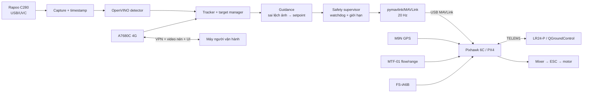
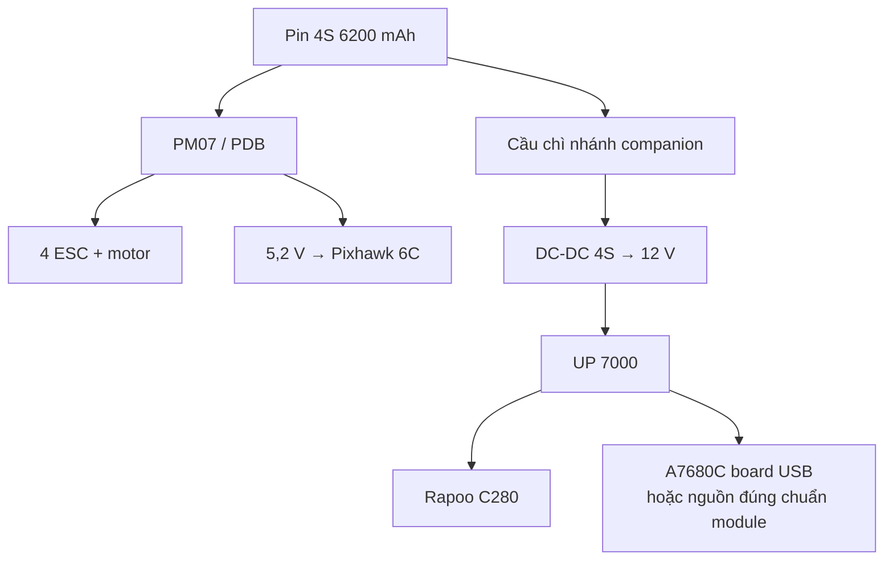
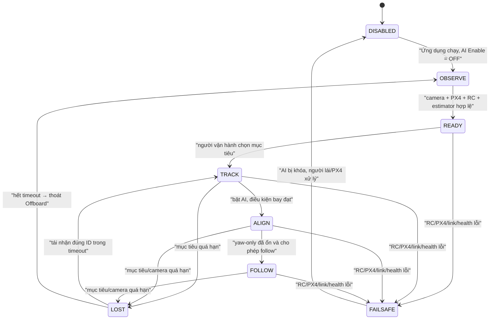

# Kế hoạch triển khai xử lý ảnh và theo dõi mục tiêu an toàn trên S500

## 1. Thông tin kế hoạch

- Ngày lập: 17/08/2026.
- Tài liệu nền: [Báo cáo phân tích video drone tự hành](./bao_cao_phan_tich_video_drone_tu_hanh.md).
- Trạng thái nền tảng: S500 đã bay waypoint, Mission và RTL ổn định; không lập lại kế hoạch chế tạo flight stack từ đầu.
- Trọng tâm: camera trước, xử lý ảnh trên máy tính nhúng, khóa/theo dõi mục tiêu do người vận hành chọn và tạo lệnh chuyển động mức cao cho PX4.
- Phạm vi sử dụng: quan sát, tìm kiếm cứu nạn, khảo sát và bay theo đối tượng ở khoảng cách an toàn.

> **Giới hạn bắt buộc:** Kế hoạch không bao gồm vũ khí, cơ cấu va chạm, truy đuổi không giới hạn hoặc điều khiển trực tiếp ESC/motor. Pixhawk/PX4 luôn giữ ổn định bay và failsafe; người lái phải có quyền ngắt AI tức thời bằng RC.

---

## 2. Kết quả cần đạt

### 2.1. MVP xử lý ảnh

Hệ thống MVP phải làm được các việc sau:

1. Nhận hình ảnh ổn định từ Rapoo C280 trên UP 7000.
2. Phát hiện lớp mục tiêu dân dụng đã chọn, trước tiên là `person`.
3. Hiển thị video, bounding box, độ tin cậy, FPS và độ trễ.
4. Cho người vận hành bấm chọn đúng một mục tiêu; không tự ý đuổi theo người xuất hiện trong ảnh.
5. Duy trì ID bằng tracker khi detector bỏ sót trong thời gian ngắn.
6. Xuất sai lệch mục tiêu so với tâm ảnh và trạng thái `TRACKED/LOST` có timestamp.
7. Ghi video và telemetry đồng bộ để đánh giá sau thử nghiệm.

### 2.2. MVP điều khiển hỗ trợ

Sau khi MVP xử lý ảnh đạt yêu cầu, hệ thống mới được phép:

1. Gửi setpoint vận tốc/yaw mức cao cho PX4 qua MAVLink Offboard.
2. Bắt đầu bằng **yaw-only**: chỉ quay để đưa mục tiêu về giữa ảnh, không tiến về mục tiêu.
3. Sau đó mới bổ sung chuyển động ngang và tiến/lùi với giới hạn tốc độ, gia tốc và khoảng cách an toàn.
4. Khi ảnh cũ, mất mục tiêu, lỗi phần mềm, mất MAVLink hoặc người lái ngắt AI: ngừng phát lệnh chuyển động, thoát Offboard về Position; PX4 tiếp tục xử lý lớp an toàn.
5. Không tự arm hoặc tự cất cánh trong phiên bản MVP. Người lái cất cánh, hover ổn định rồi mới bật AI.

### 2.3. Tiêu chí hoàn thành cấp dự án

- Theo dõi được một người đi bộ trong khu vực thử nghiệm trống và có kiểm soát.
- Mục tiêu được chọn thủ công, được giữ gần tâm ảnh, không đổi sang người khác khi giao cắt ngắn.
- Mất mục tiêu hoặc mất camera không tạo lệnh tiến ngoài ý muốn.
- RC Position/RTL và stick override giành quyền ngay trong mọi thử nghiệm.
- Mất 4G hoặc LR24-P không làm hỏng vòng điều khiển xử lý ảnh trên máy bay.
- Sau khi gắn tải mới, Mission/RTL không xuất hiện lỗi nguồn, reset, lỗi estimator hoặc suy giảm nguy hiểm về thời gian bay.

---

## 3. Cấu hình phần cứng và quyết định kiến trúc

### 3.1. Phần cứng đã có

| Khối | Thiết bị | Vai trò trong hệ thống mới |
|---|---|---|
| Khung và động lực | S500, SunnySky X2216 950 kV, cánh 1045, ESC BLHeli 40 A | Giữ nguyên, chỉ kiểm tra lại tải trọng/CG sau khi gắn thiết bị |
| Flight controller | Pixhawk 6C, PX4 v1.17 theo log hiện có | Ổn định, dẫn đường, Mission/RTL, Offboard và failsafe |
| Định vị toàn cầu | Holybro M9N Standard | Position, Mission, RTL và geofence |
| Định vị gần mặt đất | MicoAir MTF-01 optical flow/range | Hỗ trợ local position; độc lập với camera AI phía trước |
| Telemetry | MicoAir LR24-P 2.4 GHz | MAVLink Pixhawk–QGroundControl; không dùng truyền video |
| RC | FS-iA6B | Kênh an toàn độc lập, đổi mode và giành quyền khỏi AI |
| Nguồn bay | PM07, Ovonic 4S 6200 mAh | Cấp FC/động lực; không cấp trực tiếp UP 7000 từ rail 5 V của FC |

### 3.2. Phần cứng dự kiến gắn

| Thiết bị | Vai trò | Điều phải xác nhận trước khi mua/gắn |
|---|---|---|
| UP 7000 4 GB/32 GB | Xử lý ảnh và MAVLink companion | Xác nhận đúng SKU CPU N50/N97/N100; ưu tiên N97 nếu cấu hình đang nhắm tới; kiểm tra tản nhiệt và tải thực tế |
| Rapoo C280 | Camera trước USB/UVC | Dò format thật bằng `v4l2-ctl`; xác nhận MJPEG/YUYV, 720p30, exposure/focus và độ trễ |
| SIMCom A7680C | Kết nối 4G để giám sát/UI | Xác nhận là module trần hay board USB có regulator; module trần chỉ nhận 3,4–4,2 V, không được cấp 5 V trực tiếp |

### 3.3. Các quyết định kiến trúc đã chốt

| Chủ đề | Quyết định |
|---|---|
| Nơi chạy AI | Chạy trên UP 7000 gắn trên drone để vòng theo dõi không phụ thuộc 4G |
| Flight control | Pixhawk/PX4 giữ toàn quyền attitude/rate/motor; UP 7000 chỉ gửi setpoint mức cao |
| Đường companion | USB trực tiếp UP 7000 → cổng USB-C Pixhawk 6C; không đi vòng qua LR24-P và không dùng TELEM2 cho UP 7000 |
| Đường video | Camera cắm USB trực tiếp vào UP 7000; không truyền raw video qua LoRa |
| 4G | Chỉ dùng xem video nén, chọn mục tiêu, giám sát và bảo trì; không là liên kết failsafe chính |
| Stack AI ban đầu | OpenCV/V4L2 + OpenVINO + YOLOv8n baseline + tracker nhẹ |
| Framework hệ thống | Chưa dùng ROS 2 ở MVP để tiết kiệm RAM và giảm số thành phần cần chẩn đoán |
| Lựa chọn mục tiêu | Người vận hành chọn bằng click/ID; không mặc định khóa người gần nhất hoặc lớn nhất |
| Điều khiển đầu tiên | Shadow mode, sau đó yaw-only, cuối cùng mới mở vận tốc ngang và tiến/lùi |

### 3.4. Sơ đồ tổng thể



Điểm quan trọng là nhánh 4G không nằm trong vòng `tracker → supervisor → Pixhawk`. Nếu mạng 4G mất, máy bay không nhận lệnh giật cục từ Internet; supervisor thực hiện chính sách mất heartbeat đã định trước.

---

## 4. Tích hợp điện, cổng và cơ khí

### 4.1. Phân bổ cổng đề xuất

| Cổng Pixhawk 6C | Thiết bị | Cấu hình định hướng | Ghi chú |
|---|---|---|---|
| TELEM1 | LR24-P | Giữ cấu hình MAVLink/GCS hiện có, log cho thấy 57.600 baud | Không thay nếu QGC đang ổn định |
| TELEM3 | MTF-01 | Giữ cấu hình hiện có, log gợi ý MAVLink 115.200 baud | Chỉ là suy luận từ log; đối chiếu dây thật trước khi làm |
| TELEM2 | Để trống/dự phòng | Không cấu hình lại cho UP 7000 | Giữ nguyên cho mở rộng sau này; không ảnh hưởng MTF-01/LR24-P |
| RC IN | FS-iA6B | Giữ nguyên | Độc lập với companion |
| USB-C/service | UP 7000 + bảo trì | MAVLink USB CDC ACM, đường companion chính | Cáp USB-A → USB-C có data, ngắn và cố định chống rung; PM07 vẫn là nguồn chính cho FC |

Quy tắc cho đường USB companion:

- UP 7000 bản 4 GB/32 GB dùng cổng USB Type-A; dùng cáp USB-A → USB-C **có truyền dữ liệu** vào Pixhawk.
- Ưu tiên đường dẫn Linux `/dev/serial/by-id/...`; `/dev/ttyACM0` chỉ dùng để chẩn đoán ban đầu.
- Không cần đổi `MAV_0_CONFIG`, `MAV_1_CONFIG`, `MAV_2_CONFIG` hoặc tạo `SER_TEL2_BAUD` khi dùng USB trực tiếp.
- PM07 giữ vai trò nguồn chính Pixhawk; UP 7000 giữ nhánh 12 V riêng. Cáp USB phải được cố định, đặt xa dây pha motor/ESC.
- Trước khi đổi bất kỳ PX4 parameter nào, xuất một bản backup và lưu diff cấu hình.

### 4.2. Nguồn cho UP 7000

UP 7000 công bố đầu vào 12 V DC và adapter tham chiếu 12 V/5 A. PM07 cấp rail 5,2 V cho flight controller và không có đầu 12 V dành cho companion. Vì vậy cần:

1. Một nhánh riêng từ pin 4S qua cầu chì và DC-DC buck ổn áp 12 V.
2. DC-DC được chọn theo yêu cầu 12 V/5 A của bo mạch, có margin nhiệt và đáp ứng được pin 4S từ đầy đến gần cạn.
3. Đo ripple, sụt áp lúc boot và tải AI; không chỉ đo điện áp không tải.
4. Không lấy điện UP 7000 từ TELEM, USB của Pixhawk hoặc rail 5 V PM07 đang nuôi avionics.
5. Bố trí nguồn sao và lọc nhiễu để không đưa nhiễu switching từ nhánh companion vào FC/GPS; kiểm tra lại USB disconnect/reconnect khi tải AI thay đổi.



Log cũ từng ghi `Avionics Power low`, rail FMU xuống khoảng 4,65 V. Dù các log waypoint mới hơn cho thấy Mission/RTL ổn định, nhánh companion vẫn phải tách nguồn và chuyến shadow mode phải xác nhận không tái xuất hiện cảnh báo này.

### 4.3. Nguồn cho A7680C

- Nếu là **module trần**: thiết kế nguồn 3,8 V danh định trong khoảng 3,4–4,2 V theo nhà sản xuất, SIM holder, anten và USB/UART đúng layout; không cấp 5 V trực tiếp.
- Nếu là **board phát triển USB**: tuân thủ điện áp đầu vào của chính board, không suy ra từ điện áp của module trần.
- Chỉ bật modem sau khi pipeline camera/AI đã ổn định; đo thêm dòng đỉnh, nhiệt độ và nhiễu GPS/telemetry.
- Anten LTE đặt xa GPS, Pixhawk và dây camera; thử tương thích điện từ khi modem phát dữ liệu liên tục.

### 4.4. Gắn cơ khí

1. Camera đặt gần trục dọc thân, nhìn trước; dùng đệm chống rung nhưng không để camera lắc tương đối với thân.
2. Ghi chính xác góc ngẩng/chúc camera và hiệu chỉnh intrinsics sau khi cố định ngàm.
3. UP 7000 đặt gần tâm khối lượng, có luồng gió; không che barometer/GPS.
4. Modem và anten đặt xa GPS/compass; kiểm tra nhiễu ở trạng thái LTE upload liên tục.
5. Cân bốn tay motor hoặc ít nhất kiểm tra CG theo hai trục sau khi hoàn tất đi dây.
6. Cân khối lượng cất cánh mới và đo lại thời gian hover; mô hình Gazebo hiện dùng khối lượng giả định 1,68 kg nên phải cập nhật bằng số đo thật.

### 4.5. Phần phụ trợ cần chuẩn bị

- DC-DC 4S → 12 V đáp ứng yêu cầu UP 7000, cầu chì, đầu nối và dây phù hợp.
- Cáp USB-A → USB-C có data, ngắn, đầu chắc; kẹp/đai giữ cáp chống rung và chống lực kéo lên cổng Pixhawk.
- Bộ tản nhiệt/quạt phù hợp sau khi benchmark nhiệt.
- Cáp USB camera ngắn, có khóa/cố định chống rung.
- Giá camera, giá UP 7000, đệm rung và che chắn cánh quạt.
- Thẻ/USB SSD nhỏ nếu cần lưu dataset; không ghi video 2K liên tục vào eMMC 32 GB.
- Đồng hồ đo dòng/áp; oscilloscope nếu có để kiểm tra ripple.

---

## 5. Kiến trúc phần mềm đề xuất

### 5.1. Nền tảng

- Ubuntu Server 22.04 64-bit tối giản theo hỗ trợ của UP 7000.
- Python 3.10 và virtual environment cho giai đoạn MVP.
- OpenCV với V4L2 hoặc GStreamer để thu camera.
- OpenVINO Runtime để chạy detector trên Intel CPU/iGPU.
- YOLOv8n 640 px làm baseline đã có ví dụ chính thức trên OpenVINO; chỉ đổi sang YOLO11n hoặc model khác khi benchmark trên đúng bo mạch chứng minh tốt hơn.
- Tracker nhẹ kiểu ByteTrack/Kalman; ReID chỉ thêm khi dữ liệu thử nghiệm cho thấy ID-switch là vấn đề thực tế.
- `pymavlink` trực tiếp cho telemetry và Offboard để `flight_guard` sở hữu từng tick 20 Hz; không dùng background server tự resend setpoint ngoài supervisor.
- `systemd` để tự khởi động, restart có giới hạn và ghi log.

UP 7000 dòng Intel N không có NPU kiểu Intel Core Ultra. Không lập kế hoạch dựa trên NPU; benchmark `CPU`, `GPU` và `AUTO` bằng OpenVINO rồi chọn thiết bị có latency ổn định nhất.

### 5.2. Cấu trúc mã nguồn dự kiến

```text
Companion/
├── README.md
├── config/
│   ├── camera.yaml
│   ├── vision.yaml
│   ├── control_limits.yaml
│   └── vehicle.yaml
├── models/
│   ├── README.md
│   └── *.xml / *.bin
├── src/
│   ├── capture/
│   ├── detector/
│   ├── tracker/
│   ├── target_manager/
│   ├── guidance/
│   ├── safety_supervisor/
│   ├── mavlink_gateway/
│   ├── operator_ui/
│   └── recorder/
├── tools/
│   ├── probe_camera.*
│   ├── benchmark_model.*
│   ├── calibrate_camera.*
│   └── replay_session.*
├── tests/
│   ├── unit/
│   ├── replay/
│   └── sitl/
└── deploy/
    └── systemd/
```

Không cần tách thành nhiều tiến trình ngay ngày đầu. Có thể bắt đầu bằng một ứng dụng Python, nhưng các module phải có interface rõ để sau này tách `vision` khỏi `flight supervisor` mà không viết lại toàn bộ.

### 5.3. Hợp đồng dữ liệu tối thiểu

Mỗi frame/detection/setpoint đều dùng clock monotonic và có sequence number:

```text
Frame:
  frame_id, capture_ts, width, height

Detection:
  frame_id, class_id, confidence, x1, y1, x2, y2

Track:
  track_id, last_seen_ts, bbox, confidence, age, state

VisionHealth:
  camera_ok, frame_age_ms, inference_ms, fps, queue_depth

GuidanceCommand:
  source_track_id, created_ts, vx_body, vy_body, vz_body, yaw_rate

SupervisorOutput:
  state, limited_setpoint, reject_reason, px4_mode, rc_ok
```

Không dùng “frame mới nhất trong biến toàn cục” mà không có timestamp. Safety supervisor phải từ chối mọi guidance command quá hạn dù tracker vẫn còn giữ bounding box cũ.

### 5.4. Pipeline xử lý ảnh

1. Camera capture ở 1280×720/30 fps hoặc 640×480/30 fps.
2. Queue chỉ giữ frame mới nhất hoặc tối đa 2 frame; bỏ frame cũ thay vì tăng latency.
3. Resize/letterbox về 640×640 cho detector.
4. Detector chạy 8–15 fps tùy benchmark; tracker cập nhật theo frame camera.
5. Người vận hành chọn một detection để tạo `locked_track_id`.
6. Tracker dự đoán ngắn khi bị che khuất; hết timeout thì chuyển `LOST`, không tự chọn người khác.
7. Guidance nhận track hợp lệ, telemetry attitude và cấu hình camera để tính sai lệch.
8. Recorder ghi metadata mọi frame; video dùng ring buffer và giới hạn dung lượng.

Không xử lý 2K trong MVP. Độ phân giải quảng cáo của camera không có giá trị nếu làm tăng độ trễ và nhiệt mà không cải thiện khoảng cách nhận diện cần thiết.

---

## 6. State machine và luật an toàn



### 6.1. Điều kiện cho phép vào Offboard

Tất cả điều kiện sau phải đồng thời đúng:

- Máy bay đã arm và đang hover ở Position; MVP không tự arm/cất cánh.
- RC link khỏe; công tắc `AI Enable` ở vị trí ON.
- Có công tắc Position/RTL độc lập và người lái đã xác nhận cần ga ở vùng giữ độ cao trước khi takeover.
- Local position hợp lệ; GPS/global/home hợp lệ nếu vùng thử cần RTL.
- Pin trên ngưỡng thử nghiệm đã quy định; không có battery/failsafe warning.
- Camera/inference/MAVLink khỏe, frame và track chưa quá hạn.
- Target đã được người vận hành chọn và tồn tại ổn định một khoảng thời gian tối thiểu.
- Geofence, độ cao và vùng tốc độ đều hợp lệ.
- Nhiệt độ, RAM và nguồn UP 7000 trong giới hạn.
- Một setpoint zero-velocity hợp lệ đã được phát trước khi yêu cầu PX4 vào Offboard.

### 6.2. Điều kiện thoát Offboard ngay

- AI Enable OFF, người lái đổi mode hoặc stick override.
- Camera mất, frame quá cũ, tracker lỗi hoặc target `LOST` quá timeout.
- MAVLink/telemetry từ PX4 quá hạn.
- Companion quá nhiệt, thiếu RAM, tiến trình watchdog báo lỗi.
- PX4 báo estimator, battery, geofence hoặc failsafe không đạt.
- Guidance phát NaN, vượt giới hạn hoặc track ID không khớp mục tiêu đã khóa.

Trình tự thoát chủ động: ramp setpoint về zero trong khoảng ngắn nếu dữ liệu còn hợp lệ, gọi dừng Offboard/chuyển Position, xóa toàn bộ tích phân và khóa guidance. Nếu companion chết hoàn toàn, PX4 phải tự xử lý Offboard-loss theo parameter đã được thử trong SITL và bench.

### 6.3. Bài học trực tiếp từ log RC

Log `06_13_59` đã cho thấy PX4 rời Mission do `Pilot took over using sticks`, trong khi throttle ở đáy nên máy hạ trong Position. Do đó:

- Giữ quyền takeover bằng RC, nhưng bắt buộc tập quy trình đưa ga về vùng giữ độ cao trước/đồng thời khi giành quyền.
- Dành một công tắc mode rõ ràng cho Position và một vị trí RTL; không chỉ dựa vào “giật cần”.
- Trước mỗi lần thử AI, tháo cánh kiểm tra jitter kênh RC và xác nhận `COM_RC_OVERRIDE`/`COM_RC_STICK_OV` đúng ý đồ.
- Bất kỳ thay đổi parameter nào cũng phải được ghi thành diff và thử lại Mission/RTL.

### 6.4. Audit chống flyaway trước Offboard

Audit `test.params` hiện tại cho thấy ba khoảng trống phải xử lý trước chuyến Offboard thật:

- `COM_RC_OVERRIDE=1` mới bật stick override cho Auto, chưa bật bit Offboard. Giá trị ứng viên là `3` để bật cả Auto và Offboard, nhưng phải test SITL/bench và thao tác throttle-neutral trước khi áp dụng.
- `GF_MAX_HOR_DIST=0` và `GF_MAX_VER_DIST=0` nghĩa là geofence bán kính/độ cao đang tắt. P7 chỉ được bay khi đã đặt soft fence companion và hard fence PX4 có margin.
- `RC_MAP_KILL_SW=0` nghĩa là chưa map emergency kill. Kill làm motor dừng và drone rơi nên chỉ là lớp cuối, cần công tắc khó gạt nhầm và diễn tập props-off.

Ngoài ra `MPC_XY_VEL_MAX=12 m/s` quá rộng cho chuyến AI đầu nếu có lỗi lệnh. P7 phải dùng profile parameter thử nghiệm bảo thủ và khóa `vx=vy=vz=0` ngay tại flight guard. Kế hoạch an toàn, parameter audit, watchdog chống giữ setpoint cuối và bộ test SAFE-01…SAFE-15 được mô tả trong [kế hoạch điều khiển USB](./ke_hoach_dieu_khien_up7000_pixhawk_usb.md#7-safety-case-chống-bay-mất-kiểm-soát).

---

## 7. Thiết kế thuật toán điều khiển từ ảnh

### 7.1. Đại lượng đầu vào

Với tâm bounding box `(u, v)`, kích thước ảnh `(W, H)` và diện tích box `A`:

```text
ex = (u - W/2) / (W/2)       # lệch ngang, chuẩn hóa [-1, 1]
ey = (v - H/2) / (H/2)       # lệch dọc
es = log(A_target / A)        # sai lệch kích thước tương đối, chỉ dùng sau hiệu chỉnh
```

- `ex` điều khiển yaw-rate ở pha đầu.
- Sau khi yaw-only đạt, `ex` có thể tạo vận tốc ngang thân nhỏ nếu cần.
- `es` chỉ được dùng cho tiến/lùi sau khi đã hiệu chỉnh kích thước mục tiêu–khoảng cách trên đúng camera và góc lắp.
- `ey` không được biến trực tiếp thành lệnh độ cao ở MVP; độ cao tiếp tục do PX4 giữ.
- Roll/pitch và độ trễ camera làm thay đổi ảnh; cần đồng bộ attitude gần timestamp frame và bù sau khi baseline hoạt động.

### 7.2. Bộ lọc và điều khiển

1. Dùng EMA/Kalman cho tâm box, kích thước box và vận tốc ảnh.
2. Deadband quanh tâm để tránh rung liên tục.
3. PI/PID giới hạn output; khởi đầu bằng P hoặc PD, chỉ thêm I khi đã chứng minh có sai lệch tĩnh.
4. Giới hạn tốc độ, gia tốc và jerk trước khi gửi sang PX4.
5. Reset controller khi đổi target, mất target, đổi mode hoặc RC takeover.
6. Soft takeover: khi vào Offboard, ramp từ setpoint zero/current motion sang lệnh AI; không bước nhảy.

Giới hạn bảo thủ ban đầu cho thử nghiệm ngoài trời, cần tinh chỉnh theo log:

| Đại lượng | Giá trị khởi đầu |
|---|---:|
| Tốc độ ngang/yaw-only | `vx = vy = vz = 0` |
| Yaw rate tối đa | 20–30 °/s |
| Pha dịch chuyển đầu tiên | ≤ 0,5 m/s |
| Pha đi theo người sau khi đạt gate | ≤ 1,0 m/s |
| Gia tốc ngang | ≤ 0,5 m/s² |
| Deadband tâm ảnh | 5–10% chiều rộng ảnh |
| Target/frame stale | 250–500 ms tùy benchmark |
| Thời gian cho phép che khuất ngắn | 0,5–1,0 s, chỉ dự đoán; không tiến nhanh |
| Khoảng cách mong muốn ban đầu | Khoảng 6 m, thử trong vùng 5–8 m |
| Vùng không được tiến gần hơn | 4 m; nếu ước lượng không tin cậy thì không phát lệnh tiến |

Khoảng cách từ một camera đơn và kích thước bounding box chỉ là ước lượng. Vì vậy “vùng 4 m” ở MVP là interlock bảo thủ dựa trên hiệu chỉnh, không phải cảm biến tránh va chạm được chứng nhận. Nếu mục tiêu cuối cần giữ khoảng cách chính xác, cần bổ sung depth/stereo/radar hướng trước ở một giai đoạn riêng.

---

## 8. Kế hoạch thực hiện theo pha

Thời lượng ước tính cho một người làm chính là 8–10 tuần, không tính thời gian chờ mua linh kiện hoặc thời tiết. Mỗi pha có cổng nghiệm thu; không bỏ qua cổng để “thử nhanh” trên máy bay thật.

### Pha 0 — Đóng băng baseline và thiết kế chi tiết (2–3 ngày)

**Công việc**

- Backup toàn bộ PX4 parameters và ghi mapping dây TELEM1/2/3 thực tế.
- Chọn một log Mission + RTL tốt làm baseline so sánh.
- Ghi khối lượng, CG, thời gian hover, dòng trung bình và nhiệt độ hiện tại.
- Xác nhận SKU UP 7000, loại board A7680C, trọng lượng từng thiết bị và góc đặt camera.
- Chốt một kênh RC/công tắc cho AI Enable và quy trình Position/RTL takeover.
- Tạo backlog, quy ước phiên bản cấu hình và thư mục `Companion/`.

**Đầu ra**

- `baseline_parameters.params`, sơ đồ dây, bảng khối lượng và checklist preflight.
- Không thay đổi cấu hình bay chỉ để bắt đầu code xử lý ảnh.

**Gate P0**

- Có thể khôi phục nguyên trạng cấu hình Pixhawk.
- Đường USB companion đã được xác định, TELEM2 được để trống/dự phòng và kênh RC an toàn đã được xác định.

### Pha 1 — Nguồn, camera và UP 7000 trên bàn (3–5 ngày)

**Công việc**

- Cài Ubuntu Server 22.04 tối giản, SSH key, firewall, NTP và log rotation.
- Lắp DC-DC 12 V riêng; đo boot, idle, camera capture, inference và modem transmit.
- Probe C280 bằng `v4l2-ctl --all --list-formats-ext`.
- Thử các mode 720p30 và 480p30; khóa exposure/focus nếu driver/camera cho phép.
- Benchmark nhiệt 60 phút trong điều kiện luồng gió tương tự vị trí gắn.
- Chưa nối output điều khiển tới Pixhawk.

**Gate P1**

- UP 7000 chạy camera 60 phút không reboot/throttle nguy hiểm.
- Không có frame queue tăng dần, cáp camera không chập chờn.
- Nguồn 12 V không tụt khỏi giới hạn của bo mạch khi tải thay đổi.
- RAM idle đủ để còn tối thiểu khoảng 1 GB headroom cho inference/log.

### Pha 2 — Detector offline và benchmark trên bo thật (5–7 ngày)

**Công việc**

- Thu video C280 ở đúng góc lắp: trong nhà, ngoài trời, nắng/ngược sáng, người xa/gần.
- Tạo chương trình replay deterministic từ file.
- Chạy YOLOv8n OpenVINO ở `CPU`, `GPU`, `AUTO`, FP16 và sau đó INT8 nếu cần.
- Đo riêng capture, preprocess, inference, postprocess và end-to-end.
- Chọn độ phân giải/model theo P95 latency, không chọn theo FPS trung bình.
- Ghi detection ra JSON/CSV đồng bộ video.

**Gate P2**

- Inference tối thiểu 10 fps trên đúng UP 7000 ở cấu hình chọn.
- Luồng hiển thị/tracker mục tiêu đạt khoảng 20 fps trở lên.
- P95 từ capture đến detection không quá 200 ms; không có backlog frame.
- RAM toàn hệ thống dưới khoảng 3,2 GB và nhiệt độ ổn định trong 60 phút.
- Precision trên tập test nội bộ đủ để không tạo nhiều box người giả trong bối cảnh bay dự kiến.

### Pha 3 — Chọn mục tiêu, tracker và mất dấu (5–7 ngày)

**Công việc**

- Thêm UI chọn target bằng click hoặc detection ID.
- Tích hợp tracker, target lock, timeout và trạng thái LOST.
- Không tự chuyển ID khi hai người giao cắt; yêu cầu người vận hành xác nhận lại nếu mất quá timeout.
- Thử che khuất, ra/vào khung, ánh sáng thay đổi và camera rung.
- Viết test replay để cùng một video phải tạo kết quả gần như lặp lại.

**Gate P3**

- Theo dõi liên tục ít nhất 10 phút trên video/live bench.
- Mất target được báo trong ≤ 500 ms sau ngưỡng cấu hình.
- Không có guidance hợp lệ khi detection/track quá hạn.
- Tỷ lệ giữ đúng ID ≥ 90% trên các clip thử có nhiều người; mọi ID switch được ghi log.
- Sau che khuất dài, hệ thống về LOST thay vì khóa nhầm mục tiêu khác.

### Pha 4 — MAVLink companion và SITL (5–7 ngày)

**Công việc**

- Nối USB-A từ UP 7000 vào USB-C Pixhawk, cánh quạt tháo; xác nhận thiết bị CDC ACM bằng `/dev/serial/by-id` mà không đổi MAVLink instance hiện có.
- Đọc heartbeat, mode, arm, local/global position, attitude, battery và RC health.
- Tạo `safety_supervisor`; mọi output phải qua limiter/watchdog.
- Dùng PX4 SITL/Gazebo hiện có; cập nhật khối lượng và bổ sung camera trước/mục tiêu chuyển động nếu cần.
- Trước khi camera mô phỏng hoàn chỉnh, dùng synthetic track hoặc replay video để test vòng control.
- Thử mất setpoint, kill tiến trình, rút camera, rút USB, target LOST, RC takeover và RTL.

**Gate P4**

- Setpoint phát ổn định 20 Hz, P99 khoảng cách giữa setpoint < 100 ms.
- Không thể vào Offboard khi thiếu bất kỳ interlock nào.
- Mọi fault injection đưa SITL/bench về Position hoặc hành vi PX4 đã cấu hình, không tiếp tục lệnh cũ.
- Guidance không có quyền arm/disarm và không gửi actuator/motor command trực tiếp.
- 20 lần lặp enter/exit Offboard không tạo bước nhảy setpoint.

### Pha 5 — Tích hợp toàn bộ trên drone, tháo cánh (2–3 ngày)

**Công việc**

- Gắn UP 7000, camera, DC-DC và cáp; modem để OFF trước.
- Chạy full stack 60 phút, QGC + LR24-P hoạt động song song.
- Bật/tắt AI switch, đổi Position/RTL, tạo RC jitter có kiểm soát và kill từng service.
- Arm bench chỉ khi quy trình hiện tại cho phép và cánh đã tháo; theo dõi rail 5 V/12 V.
- Kiểm tra nhiễu GPS/compass khi CPU tải cao và khi sau này bật LTE.

**Gate P5**

- Không có reset Pixhawk/UP 7000, không mất LR24-P bất thường.
- Không tái xuất hiện cảnh báo rail avionics thấp do tích hợp mới.
- RC luôn đổi mode được; AI Enable OFF khóa hoàn toàn guidance.
- Dây/cáp không thể chạm cánh, không tuột khi rung.

### Pha 6 — Shadow mode trên không, AI không điều khiển (2–3 chuyến)

**Công việc**

- Bay Mission/Position/RTL quen thuộc với toàn bộ payload, nhưng companion chỉ ghi hình và dự đoán setpoint giả.
- Có người mục tiêu đứng/đi trong vùng an toàn; không đưa lệnh vision vào PX4.
- Đồng bộ ULog, video, detection, thermal, nguồn và predicted command.
- So sánh thời gian bay, dòng, rung, GPS/compass, GCS link và estimator với baseline.

**Gate P6**

- Ít nhất hai chuyến shadow hoàn thành và RTL/landing bình thường.
- Không có power warning, reboot, estimator failure, RC loss hoặc GCS loss mới do payload.
- Target tracking đạt KPI P3 từ góc nhìn thật trên không.
- Predicted command không có spike, NaN hoặc lệnh tiến khi target LOST.
- Thời gian bay còn margin đủ cho thử nghiệm và RTL; chốt ngưỡng pin mới theo dữ liệu.

### Pha 7 — Điều khiển yaw-only (3–5 chuyến)

**Công việc**

- Khu vực trống, có spotter, người mục tiêu hợp tác và giữ khoảng cách lớn.
- Người lái cất cánh và hover ở Position 3–5 m; bật AI yaw-only.
- Tune deadband, lọc, P/PD và ramp; không mở `vx`, `vy`, `vz`.
- Thử target dừng, đi ngang chậm, che khuất ngắn, mất camera và RC takeover.

**Gate P7**

- Mục tiêu nằm trong ±10% bề rộng quanh tâm ảnh phần lớn thời gian khi đi chậm.
- Không dao động yaw tăng dần; không có lệnh vượt 30 °/s.
- LOST/camera disconnect đưa máy về Position theo timeout đã định.
- RC takeover thành công trong mọi lượt thử và người lái giữ được độ cao.

### Pha 8 — Dịch chuyển ngang và bay theo khoảng cách an toàn (5–10 chuyến)

**Công việc**

- Mở từng trục một: lateral/body-y trước, forward/backward sau.
- Hiệu chỉnh bbox size theo khoảng cách 4/5/6/8/10 m ở nhiều tư thế người.
- Bật giới hạn 0,5 m/s trước; chỉ tăng tối đa 1,0 m/s sau khi log chứng minh ổn định.
- Thử đi thẳng, đổi hướng chậm, dừng đột ngột, người khác đi ngang và occlusion.
- Không thử gần cây, công trình, xe hoặc đám đông khi chưa có tránh vật cản hướng trước.

**Gate P8**

- Không vượt vùng khoảng cách tối thiểu trong tất cả test case đã định.
- Sai lệch tâm ảnh và khoảng cách hội tụ, không hunting kéo dài.
- Khi target dừng hoặc LOST, vận tốc lệnh về zero có kiểm soát.
- Không đổi sang người không được chọn.
- 10 lượt liên tiếp không cần can thiệp vì lỗi phần mềm; can thiệp an toàn có chủ đích vẫn phải được thử.

### Pha 9 — Tích hợp 4G và UI từ xa (3–5 ngày)

**Công việc**

- Đưa A7680C lên Linux qua USB ECM/RNDIS/PPP tùy board/driver thực tế.
- Dùng VPN, SSH key và xác thực; không mở cổng điều khiển trực tiếp ra Internet.
- Stream H.264 độ phân giải thấp, khởi đầu 640×360, 10–15 fps, khoảng 0,5–1,5 Mbit/s.
- UI gửi target selection/heartbeat; tracking và control vẫn chạy onboard.
- Giả lập 4G có latency, jitter, packet loss, mất mạng 1/5/30 giây.

**Gate P9**

- Mất 4G không làm treo vision, MAVLink hoặc Pixhawk.
- UI báo rõ video stale; lệnh chọn target có sequence/timestamp và không được replay.
- Không truyền video qua LR24-P.
- LTE upload liên tục không làm giảm GPS/compass/telemetry hoặc gây brownout.

### Pha 10 — Tối ưu và đóng gói (1–2 tuần)

**Công việc**

- Bổ sung dataset lỗi thực tế, fine-tune detector nếu model COCO không đủ.
- Quantize INT8 chỉ khi đo được lợi ích và độ chính xác không giảm quá ngưỡng.
- Chuyển module safety/MAVLink sang C++ nếu Python/gRPC không đáp ứng latency/độ tin cậy.
- Đóng gói service, cấu hình versioned, health telemetry và log rotation.
- Viết manual vận hành, preflight, post-flight và recovery image cho UP 7000.

**Gate P10**

- Có bản release tái cài đặt được, model/config có checksum và rollback.
- Test replay, SITL, bench và flight acceptance đều pass cho cùng một release.
- Một người khác có thể vận hành theo tài liệu mà không cần sửa code tại hiện trường.

---

## 9. Lịch triển khai gợi ý

| Tuần | Mục tiêu chính | Mốc quyết định |
|---:|---|---|
| 1 | P0 + P1: baseline, nguồn, OS, camera | Có giữ UP 7000 4 GB hay cần nâng cấu hình/tản nhiệt? |
| 2 | P2: detector và benchmark | Chốt model, device CPU/GPU, resolution |
| 3 | P3: target selection/tracker | Tracker có đủ ổn định hay cần dữ liệu/fine-tune? |
| 4 | P4: MAVLink/SITL/supervisor | Offboard/failsafe đã deterministic chưa? |
| 5 | P5 + P6: tích hợp và shadow flights | Payload có ảnh hưởng nguồn/bay không? |
| 6 | P7: yaw-only | Có đạt centering mà không dao động không? |
| 7–8 | P8: lateral + safe follow | Monocular range có đủ hay phải thêm depth sensor? |
| 9 | P9: 4G/UI | Mạng/nhiễu/nguồn đạt yêu cầu không? |
| 10 | P10: hardening, tài liệu, release | Sẵn sàng vận hành lặp lại |

Nếu chỉ cần “xử lý ảnh và tracking, chưa điều khiển máy bay”, có thể dừng ở P3. Nếu cần demo AI trên máy bay nhưng không tự bay theo, dừng ở P6 là một mốc an toàn và có giá trị kỹ thuật cao.

---

## 10. Ma trận kiểm thử lỗi

| Tình huống | Cách tạo lỗi | Kết quả bắt buộc |
|---|---|---|
| Camera rút cáp | Rút USB ở bench/SITL | `camera_ok=false`, không còn guidance, thoát Offboard |
| Frame bị kẹt | Giữ frame cuối nhưng process còn sống | Watchdog theo timestamp phát hiện stale |
| Detector crash | Kill process/thread | Supervisor zero command và thoát Offboard |
| Tracker đổi ID | Hai người giao cắt | Không tự đổi target; LOST hoặc yêu cầu chọn lại |
| Mất target | Người ra khỏi khung | Không tiếp tục lệnh tiến theo prediction dài |
| MAVLink mất | Rút USB/kill gateway | PX4 thực hiện Offboard-loss đã cấu hình |
| LR24-P mất | Tắt GCS telemetry | RC và companion onboard vẫn độc lập; xử lý theo policy nhiệm vụ |
| 4G mất | Ngắt anten/network | Vision không treo; UI stale; follow dừng theo operator-heartbeat policy |
| RC takeover | Đổi Position/RTL hoặc stick override | AI khóa ngay, controller reset |
| RC loss | Tắt transmitter trong test được kiểm soát | PX4 RC-loss action đúng parameter |
| CPU quá nhiệt | Hạn chế gió/tạo tải có kiểm soát | Giảm inference hoặc disable AI trước thermal shutdown |
| RAM đầy | Stress có giới hạn ở bench | Watchdog disable AI; không swap storm/eMMC full |
| eMMC gần đầy | Giới hạn quota/ring buffer | Dừng ghi video, control vẫn an toàn |
| Guidance NaN/spike | Unit test/fault injection | Limiter từ chối lệnh, ghi reject reason |
| Pin thấp | SITL/bench mô phỏng | Không cho vào Offboard hoặc PX4 thực hiện battery action |
| GPS/home không hợp lệ | SITL/che GPS có kiểm soát | Không mở chức năng cần RTL/global position |

Mỗi test phải có mã test, phiên bản code/model/config, log đầu vào và PASS/FAIL. Không chỉ ghi “đã thử thấy ổn”.

---

## 11. Kế hoạch dữ liệu và đánh giá mô hình

### 11.1. Dataset tối thiểu

Thu dữ liệu bằng đúng Rapoo C280 và góc lắp cuối cùng:

- Nắng thuận, ngược sáng, bóng râm và gần hoàng hôn.
- Người ở khoảng 4, 6, 8, 10, 15 và 20 m.
- Người đứng, đi ngang, đi xa/gần, quay lưng, cúi/ngồi.
- Một người và nhiều người; giao cắt; che khuất ngắn/dài.
- Nền có cây, cột, xe, bóng người và texture dễ gây false positive.
- Hover, yaw, tăng/giảm cao độ nhẹ để có rung và motion blur thật.

Tách train/validation/test theo **phiên quay**, không chia ngẫu nhiên các frame liền nhau vì sẽ làm điểm đánh giá cao giả tạo.

### 11.2. Thứ tự phát triển mô hình

1. Dùng pretrained model để xây pipeline hoàn chỉnh.
2. Thu failure cases từ bench và shadow flights.
3. Chỉ fine-tune khi có lỗi lặp lại được và tập dữ liệu đủ đa dạng.
4. Đánh giá FP16 trước; INT8 sau, với calibration set đại diện.
5. Không dùng mAP làm thước đo duy nhất; đo cả false positive, recall theo khoảng cách, ID-switch, latency P95/P99 và lỗi trong chuỗi thời gian.

### 11.3. Quyền riêng tư

- Chỉ quay người tham gia đã đồng ý trong khu vực thử nghiệm.
- Tự động xoá/rút gọn video không cần thiết; dataset phải có người quản lý và thời hạn lưu.
- Không đưa video nhận diện người lên dịch vụ công cộng nếu chưa được phép.

---

## 12. KPI kỹ thuật và tiêu chí nghiệm thu

### 12.1. Camera và AI

| KPI | Mức MVP |
|---|---:|
| Capture | 720p30 hoặc 480p30 ổn định 60 phút |
| Detector | ≥ 10 fps trên UP 7000 |
| Tracker/output | ≥ 20 fps nếu camera cho phép |
| P95 capture → detection | ≤ 200 ms |
| Frame queue | ≤ 2; ưu tiên drop frame cũ |
| RAM hệ thống | ≤ khoảng 3,2/4 GB trong bài test 60 phút |
| Target stale detection | 250–500 ms theo cấu hình được chứng minh |
| Giữ đúng ID | ≥ 90% trên bộ clip chấp nhận |

### 12.2. Companion/PX4

| KPI | Mức MVP |
|---|---:|
| Setpoint stream | 20 Hz |
| P99 gap giữa setpoint | < 100 ms |
| Fault injection | 100% test bắt buộc đưa hệ thống về trạng thái đã định |
| Quyền RC | Position/RTL/takeover thành công trong mọi test |
| Direct actuator command | 0 |
| Auto-arm từ companion | 0 trong MVP |

### 12.3. Bay thật

| KPI | Mức MVP |
|---|---:|
| Shadow flights sạch | ≥ 2 chuyến liên tiếp |
| Yaw-only | Target trong ±10% bề rộng tâm ảnh phần lớn thời gian đi chậm |
| Yaw rate | ≤ 30 °/s |
| Follow speed | Bắt đầu ≤ 0,5 m/s; trần MVP 1,0 m/s |
| Khoảng cách thử | Mục tiêu 5–8 m, không chủ động vượt vùng tối thiểu đã hiệu chỉnh |
| Power/estimator/RC fault do payload | 0 |
| Lượt full-follow liên tiếp không lỗi phần mềm | 10 |

Các KPI là ngưỡng khởi đầu. Sau P2/P6 cần cập nhật bằng số đo đúng bo mạch, camera, khối lượng và điều kiện bay; mọi thay đổi phải ghi lý do.

---

## 13. Backlog ưu tiên

| ID | Hạng mục | Ưu tiên | Phụ thuộc | Đầu ra |
|---|---|---:|---|---|
| SYS-001 | Backup PX4 params + mapping cổng | P0 | Không | Baseline có thể rollback |
| HW-001 | Xác nhận SKU UP 7000 và A7680C | P0 | Không | Datasheet/BOM đúng |
| PWR-001 | Thiết kế nhánh 12 V riêng | P0 | HW-001 | Sơ đồ, đo tải và ripple |
| CAM-001 | Probe C280/UVC | P0 | UP 7000 | Danh sách mode camera |
| CAM-002 | Camera calibration | P1 | Ngàm cuối | Intrinsics + góc lắp |
| CV-001 | Replay pipeline | P0 | CAM-001 | Video → detection log |
| CV-002 | Benchmark OpenVINO | P0 | CV-001 | Báo cáo CPU/GPU/AUTO |
| CV-003 | Target selection + tracker | P0 | CV-001 | Locked target state |
| SAFE-001 | Timestamp/watchdog/limiter | P0 | CV-003 | Guidance được kiểm soát |
| MAV-001 | USB MAVLink read-only | P0 | SYS-001 | Telemetry health |
| MAV-002 | Offboard in SITL | P0 | SAFE-001, MAV-001 | Enter/exit deterministic |
| SIM-001 | Synthetic track/front camera | P1 | MAV-002 | Test closed loop |
| UI-001 | Local operator UI | P1 | CV-003 | Click target + health |
| FLT-001 | Shadow flight | P0 | P5 pass | Dataset và regression report |
| FLT-002 | Yaw-only | P0 | FLT-001 | Tuned yaw controller |
| FLT-003 | Safe follow | P1 | FLT-002 | Lateral/forward controller |
| NET-001 | 4G + VPN | P2 | FLT-002 ổn | Kênh giám sát bảo mật |
| OPT-001 | Fine-tune/INT8 | P2 | Failure dataset | Model tối ưu |

P0 ở bảng backlog nghĩa là bắt buộc cho MVP, không phải tên pha.

---

## 14. Rủi ro chính và phương án giảm thiểu

| Rủi ro | Ảnh hưởng | Giảm thiểu |
|---|---|---|
| UP 7000 chỉ 4 GB RAM/32 GB eMMC | OOM, log đầy, latency | Ubuntu tối giản, queue nhỏ, model nano, ring buffer, log quota, USB storage khi cần |
| Không có NPU | FPS thấp/nhiệt cao | OpenVINO CPU/iGPU benchmark, FP16/INT8, giảm resolution, detector chạy thưa hơn tracker |
| C280 là webcam hội nghị | Rolling shutter, autofocus hunting, latency | Probe/lock control, ngàm cứng, benchmark motion; thay camera nếu không qua P1/P2 |
| Camera đơn không đo depth tốt | Tiến quá gần/dao động khoảng cách | Yaw-only trước, hiệu chỉnh scale, giới hạn bảo thủ; thêm cảm biến depth nếu P8 không đạt |
| Payload làm giảm thời gian bay | RTL thiếu margin | Cân/đo hover, shadow flights, cập nhật battery threshold và thời gian nhiệm vụ |
| Nguồn companion làm sụt FC | Reset/failsafe | Nhánh DC-DC riêng, đo ripple/tải; không dùng rail 5 V avionics |
| LTE gây nhiễu hoặc brownout | GPS/telemetry lỗi | Tích hợp sau, anten cách ly, test upload liên tục, nguồn đúng chuẩn |
| 4G latency/jitter | UI trễ/lệnh cũ | AI onboard, timestamp/sequence, VPN, remote heartbeat và stale rejection |
| LoRa không đủ video | Không quan sát được | LR24-P chỉ MAVLink; video nén qua 4G |
| Target ID-switch | Theo nhầm người | Chọn target thủ công, timeout, không auto-switch, thêm ReID nếu dữ liệu yêu cầu |
| Python/service crash | Lệnh cũ kéo dài | Safety supervisor, watchdog timestamp, systemd, PX4 Offboard-loss |
| Thay PX4 params làm hỏng baseline | Mission/RTL thoái lui | Backup/diff, thay tối thiểu, SITL/bench, regression Mission/RTL |
| RC takeover với throttle ở đáy | Hạ ngoài ý muốn | Quy trình throttle-neutral, mode switch riêng, diễn tập có spotter |

---

## 15. Những việc cố ý chưa làm

- Không gửi hình ảnh/video qua LR24-P.
- Không dùng 4G làm kênh điều khiển ổn định bay hoặc failsafe duy nhất.
- Không cho companion ghi actuator/motor output.
- Không bật full-follow trong chuyến đầu mang payload.
- Không dùng prediction của tracker để tiếp tục tiến lâu khi mất mục tiêu.
- Không tự chọn người khác sau khi target đã mất.
- Không tự arm/cất cánh trong MVP.
- Không xử lý video 2K chỉ vì camera hỗ trợ 2K.
- Không thêm ReID, ROS 2 hoặc custom model trước khi baseline đơn giản có số đo rõ ràng.
- Không triển khai chế độ tiếp cận/va chạm nguy hiểm được nhắc trong video tham chiếu.

---

## 16. Việc nên làm ngay trong 7 ngày đầu

### Ngày 1

- Chụp/ghi sơ đồ tất cả cổng đang cắm trên Pixhawk.
- Export PX4 parameters.
- Xác nhận SKU UP 7000 và loại board A7680C.
- Cân từng thiết bị và ước tính khối lượng cất cánh.

### Ngày 2

- Lắp nguồn 12 V riêng trên bàn, chưa gắn drone.
- Cài Ubuntu tối giản và theo dõi nguồn/nhiệt lúc idle.

### Ngày 3

- Probe Rapoo C280; ghi 10 phút ở từng mode khả dụng.
- Chọn provisional mode 720p30 hoặc 480p30.

### Ngày 4

- Chạy OpenVINO detector từ file video.
- Ghi số đo latency từng stage.

### Ngày 5

- Chạy camera live + detector 60 phút.
- Benchmark CPU/GPU/AUTO và chọn baseline.

### Ngày 6

- Thu bộ video đầu tiên ở các khoảng cách/ánh sáng khác nhau.
- Tạo replay test và format detection log.

### Ngày 7

- Tổng hợp báo cáo P1/P2: mode camera, FPS, P95/P99 latency, RAM, nhiệt, điện năng.
- Chỉ sau báo cáo này mới quyết định có cần camera khác, tản nhiệt khác hoặc nâng RAM/compute.

Trong tuần đầu **không cần bay Offboard** và chưa cần gắn modem 4G.

---

## 17. Thông tin cần điền trước khi bắt đầu P1

- [ ] UP 7000 chính xác là N50, N97 hay N100.
- [ ] A7680C là module trần hay board USB, tên/ảnh/link board.
- [ ] Trọng lượng UP 7000 + tản nhiệt + nguồn + C280 + modem + ngàm + dây.
- [ ] TELEM1/2/3 đang cắm thiết bị nào trên máy thật.
- [ ] Channel/switch RC dành cho AI Enable, Position và RTL.
- [ ] Camera sẽ lắp cố định hướng trước hay có gimbal.
- [ ] Lớp mục tiêu MVP ngoài `person` có cần thêm phương tiện/marker/hàng hóa hay không.
- [ ] Khu vực, độ cao, khoảng cách và tốc độ thử nghiệm cho phép.

Những mục này không ngăn việc viết pipeline replay, nhưng phải chốt trước khi đấu điện và trước P4.

---

## 18. Nguồn kỹ thuật chính

- [UP 7000 — trang sản phẩm chính thức](https://up-board.org/up-7000/) và [datasheet UP 7000](https://up-board.org/images/UP-7000/UP-7000-datasheet.pdf): SKU, 4/8 GB RAM, 32/64 GB eMMC, Ubuntu 22.04, kích thước và nguồn 12 V.
- [Pixhawk 6C ports — Holybro](https://docs.holybro.com/autopilot/pixhawk-6c/pixhawk-6c-ports): TELEM1/2/3, UART 3,3 V và pinout.
- [PM07 Quick Start Guide — Holybro](https://docs.holybro.com/power-module-and-pdb/power-module/pm07-quick-start-guide): rail 5,2 V của flight controller và giới hạn phần nguồn/PDB.
- [MicoAir MTF-01](https://micoair.com/optical_range_sensor_mtf-01/): UART/MAVLink, optical flow và range sensor.
- [MicoAir LR24 telemetry](https://store.micoair.com/product/lr24-telemetry-radio/): radio LoRa hai chiều 2,4 GHz cho telemetry.
- [SIMCom A7680C](https://cn.simcom.com/product/A7680C.html): LTE Cat 1, USB/UART và nguồn module 3,4–4,2 V.
- [PX4 Offboard mode v1.17](https://docs.px4.io/v1.17/en/flight_modes/offboard): yêu cầu proof-of-life, điều kiện vào/thoát Offboard và loss behavior.
- [MAVSDK Offboard Control](https://mavsdk.mavlink.io/main/en/cpp/guide/offboard.html): velocity/yaw setpoint và cơ chế resend 20 Hz.
- [OpenVINO live object detection](https://docs.openvino.ai/2024/notebooks/object-detection-with-output.html): YOLOv8 + OpenVINO + webcam.
- [OpenVINO GPU device](https://docs.openvino.ai/2025/openvino-workflow/running-inference/inference-devices-and-modes/gpu-device.html) và [AUTO device selection](https://docs.openvino.ai/2025/openvino-workflow/running-inference/inference-devices-and-modes/auto-device-selection.html): benchmark/chọn CPU–iGPU.

---

## 19. Kết luận

Vì S500 đã bay waypoint ổn định, bước hợp lý không phải là thay đổi flight controller hoặc viết lại chức năng dẫn đường. Dự án nên giữ nguyên Pixhawk/PX4 làm lõi an toàn và xây một lớp companion độc lập theo chuỗi:

```text
Camera → Detection → Target lock → Tracking → Safety supervisor → MAVLink Offboard
```

Mốc quan trọng nhất là P6: chứng minh toàn bộ camera/AI chạy trên máy bay thật, có log tốt và không ảnh hưởng Mission/RTL, nhưng chưa điều khiển máy. Sau đó mới tăng quyền theo từng nấc yaw-only, lateral và safe follow. Cách chia này tạo ra sản phẩm xử lý ảnh hữu ích ngay từ P3/P6, đồng thời tránh đánh đổi nền tảng waypoint ổn định để lấy một demo tự hành chưa được kiểm chứng.
