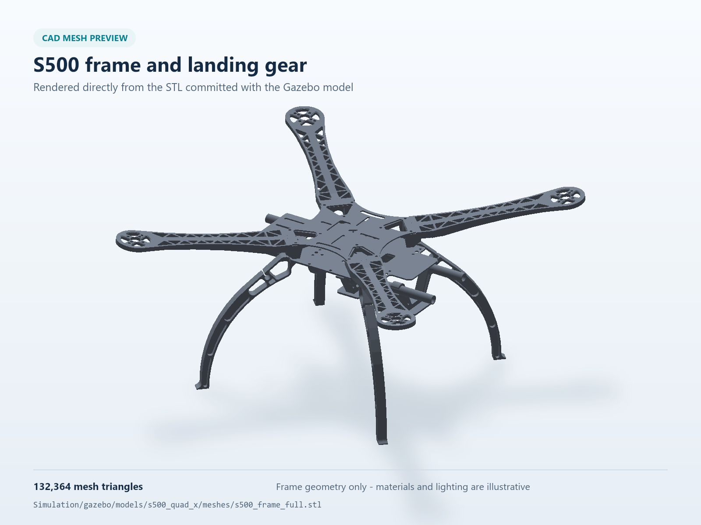
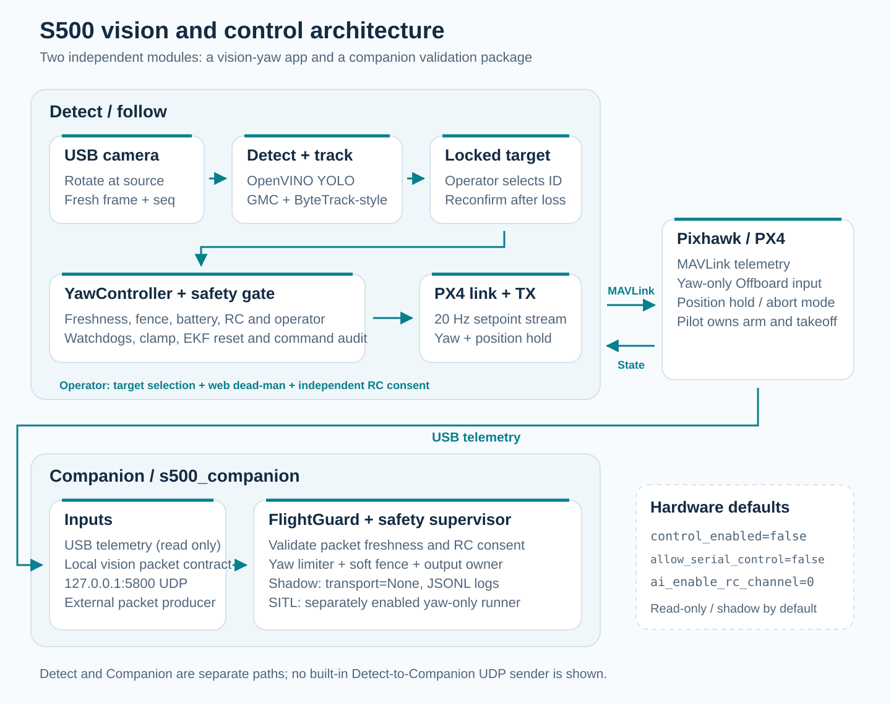
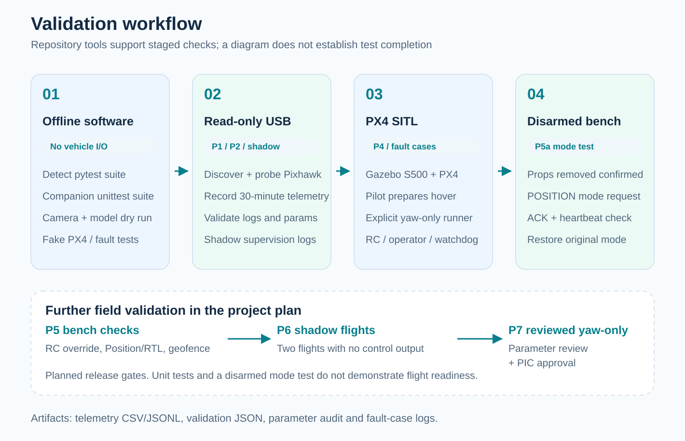

# S500 Vision Follow Drone

**Camera-based person tracking and yaw-only control for an S500 quadcopter.**

Python 3.10+ · YOLO / OpenVINO · MAVLink / PX4 · UP 7000 / Pixhawk 6C · Gazebo

[English](#english) | [Tiếng Việt](#tieng-viet)



*Source-derived frame preview rendered from the committed S500 STL mesh, with illustrative materials and lighting.*

<a id="english"></a>

## English

This project keeps a selected person in the camera's view by rotating the drone around its yaw axis. The vision application detects people with YOLO through OpenVINO, tracks the selected target, and sends gated MAVLink Offboard setpoints to PX4.

The current follow profile holds position while changing yaw. It does not implement distance-following, autonomous pursuit, or obstacle avoidance. The repository also includes a separate telemetry and safety companion package, a Gazebo S500 model, and Vietnamese engineering plans.

> [!IMPORTANT]
> `Detect/follow.app` and the Companion SITL yaw runner do not arm or take off automatically. Some helpers in `Detect/tools/`, including `sitl_arm.py` and `sitl_drive.py`, **do issue arm commands** and are intended for simulation. Review each tool before running it.
>
> Real-hardware control is locked by default in the Companion configuration. Simulation, unit tests, and a rendered model do not establish readiness for hardware flight.

### Features and architecture

| Area | Implementation |
|---|---|
| Detection | OpenVINO inference, person-class filtering, confidence and bounding-box checks |
| Tracking | Camera-motion compensation, in-repo ByteTrack-style tracker, selected-target lock, HSV appearance matching |
| Follow control | Yaw controller with deadzone, rate and slew limits, ramp and optional feed-forward |
| Operator interface | Local web interface, token authentication, live MJPEG view, target selection and hold-to-engage |
| Safeguards | Freshness checks, RC dead-man, pilot-stick override, soft fence, watchdogs, command audit and EKF-reset detection |
| Logging | Detect CSV and optional video; Companion telemetry CSV/JSONL and validation reports |
| Companion | USB discovery, read-only telemetry, parameter audit, safety supervisor, shadow mode and gated SITL yaw test |
| Simulation | CAD-derived visual mesh, PX4 Gazebo bridge, optical-flow camera, rangefinder and navigation sensors |



*Architecture derived from the source modules. Detect sends MAVLink directly to PX4. Companion is a separate implementation with a local UDP vision-packet contract; connecting a detector to that contract requires an adapter.*

### Documented hardware platform

| Component | Repository reference |
|---|---|
| Airframe | S500 quadcopter |
| Flight controller | Holybro Pixhawk 6C; project documentation targets PX4 v1.17 |
| Companion computer | UP 7000, 4 GB RAM / 32 GB storage |
| Vision camera | Rapoo C280 USB camera |
| Motors | SunnySky X2216 950 kV |
| Radio control | FlySky FS-i6 / FS-iA6B |
| Power | PM07 power module, Ovonic 4S 6200 mAh battery |
| Optical flow | MTF-01 flow and rangefinder module |

The Gazebo model uses an estimated 1.68 kg mass and provisional DJI 9450 / 940 kV propulsion assumptions. These are not calibrated to the documented motors and must be reviewed before interpreting flight behavior.

### Repository layout

```text
S500-Vision-Follow-Drone/
├── Detect/                        # Direct vision-follow app
│   ├── follow/                    # Camera, detection, tracking, yaw, safety, web UI
│   ├── tests/                     # Unit and simulated-link tests
│   └── tools/                     # Diagnostics and bench/SITL scenarios
├── Companion/                     # Separate s500-companion Python package
│   ├── src/s500_companion/         # Telemetry, guards, transports and validators
│   ├── config/                    # Hardware, SITL and safety defaults
│   ├── deploy/                    # UP 7000 setup and USB recording scripts
│   └── tests/                     # Software tests
├── Simulation/gazebo/             # Model, world and WSL launchers
├── Plan/                          # Engineering and benchmark plans
├── docs/images/                   # README illustrations
└── OpticalFlow_Hover_Test.params   # PX4 parameter profile to review before use
```

### 1. Vision dry run

Use Python 3.10 or newer. These commands use a Linux/WSL shell; a USB camera must be available to the environment running Python.

```bash
git clone https://github.com/TuanLinh05/S500-Vision-Follow-Drone.git
cd S500-Vision-Follow-Drone/Detect

python3 -m venv .venv
source .venv/bin/activate
python -m pip install -r requirements.txt
```

**Prepare the model first.** Weights and exported OpenVINO folders are excluded from Git. Export a compatible YOLO model locally, then pass its `.xml` path or export directory to `--model`. The loader requires:

- OpenVINO IR topology `.xml` and corresponding `.bin` weights. See the [OpenVINO IR format documentation](https://docs.openvino.ai/2026/documentation/openvino-ir-format.html).
- NMS-free output shaped `[batch, N, 6]`, interpreted as `[x1, y1, x2, y2, confidence, class_id]`.
- Person class ID `0`, and input size matching `--imgsz` (default `416`).

The default directory `yolo26n_int8_openvino_model` is **not included**. Raw YOLO exports with a different output shape are rejected; renaming a folder does not make an export compatible. Ultralytics/export and INT8 calibration dependencies are not included in `Detect/requirements.txt`.

Once that model exists in `Detect/`, run:

```bash
python -m follow.app \
  --camera 0 \
  --model yolo26n_int8_openvino_model \
  --device CPU \
  --imgsz 416
```

This command has no MAVLink connection or enabled flight control. Open the tokenized URL printed in the terminal, normally `http://127.0.0.1:8080/?t=<token>`, to view the camera and select a person. CPU is explicit for an initial run; the application's default device is GPU.

Verify the upright image and yaw direction before control tests. `--cam-rot` supports `0/90/180/270`; recheck the effective horizontal FOV with `--hfov`, or use calibrated `--fx-px`. Detailed flags and CSV fields are documented in [Detect/README.md](Detect/README.md).

### 2. Read-only Pixhawk telemetry

The documented UP 7000 deployment uses Ubuntu 22.04 and Python 3.10+. From the repository root:

```bash
cd Companion
bash deploy/install_up7000.sh
source .venv/bin/activate

s500-companion discover
s500-companion probe --duration 10
```

`probe` listens to MAVLink without sending arm, mode or setpoint commands. For USB permission issues, follow the `dialout` instructions in [Companion/README.md](Companion/README.md).

The hardware defaults are `connection="auto"`, `control_enabled=false`, `allow_serial_control=false` and `ai_enable_rc_channel=0`. These Companion settings do not configure or authorize the separate Detect application.

To inspect the supervisor without creating a control transport:

```bash
python tools/shadow_run.py --duration 600 --output logs/shadow.jsonl
```

Shadow mode receives vision packets on `127.0.0.1:5800`. Without a compatible packet producer, it records missing/stale vision rather than demonstrating end-to-end detection.

### 3. Gazebo and PX4 SITL in WSL

Install Gazebo Harmonic (`gz`) and build compatible PX4 SITL separately. The launchers require `build/px4_sitl_default/bin/px4` and the built `libOpticalFlowSystem.so`; neither PX4 nor Gazebo is bundled in this repository.

Build using `make px4_sitl` from a PX4 checkout in the Linux filesystem. Both launchers default to `$HOME/PX4-Autopilot`; set `PX4_AUTOPILOT_HOME` if the checkout is elsewhere. From the S500 repository root, use **two terminals**:

```bash
# Terminal 1: Gazebo world and S500 model
export PX4_AUTOPILOT_HOME="$HOME/PX4-Autopilot"
bash Simulation/gazebo/run_s500_gazebo_wsl.sh
```

```bash
# Terminal 2: attach PX4 to the existing model
export PX4_AUTOPILOT_HOME="$HOME/PX4-Autopilot"
bash Simulation/gazebo/run_s500_px4_sitl_wsl.sh
```

The launchers use world `s500_empty`, model `s500_quad_x` and PX4 airframe `4001`. They start without an automatic arm command. The world origin is `10.772100, 106.657900`, with elevation `10 m`.

The Gazebo launcher defaults to OGRE1 for the documented WSLg setup. Use `S500_GZ_RENDER_ENGINE=ogre2` only where that renderer works. Under WSL2 NAT, the documented Windows QGroundControl link uses local UDP `14550` and server `<WSL-IP>:18570`. See [Simulation/gazebo/README.md](Simulation/gazebo/README.md) for model and connection details.

To connect Detect to SITL **without enabling its control output**, run from `Detect/` with its environment and model ready:

```bash
python -m follow.app \
  --model yolo26n_int8_openvino_model \
  --device CPU \
  --mavlink udp:127.0.0.1:14540
```

PX4 and Python must share a network environment, or UDP routing must be configured explicitly. Do not run both applications against the same listening UDP port or serial device simultaneously.

### Validation and control boundaries



*Workflow based on repository test and deployment plans. These are validation steps, not completed flight milestones.*

After installing each package's dependencies, run tests in the corresponding environment:

```bash
# From Detect/
python -m pytest tests/ -v

# From Companion/
python -m unittest discover -s tests -v
```

The suites include target loss, stale data, yaw limiting, fences, watchdogs, operator consent and control authorization. Run the tests for your checkout and retain the results.

Active Detect control requires explicit `--enable-control`, an appropriate RC dead-man channel and a positive `--batt-min`, plus valid telemetry, target selection and operator engagement. A channel such as `7` is not universally available: it must be independent of PX4 `RC_MAP_*` functions. Flags labeled SITL/bench bypass checks only for those environments.

| Condition | Implemented response / dependency |
|---|---|
| Target lost, stale or requiring identity confirmation | Block yaw; require confirmation when target identity is uncertain |
| RC dead-man released, pilot stick input or fatal gate failure | Disengage and invoke the configured exit behavior |
| Main-loop stall | Independent watchdog can request emergency stream-off |
| Invalid or excessive yaw command | Reject non-finite values and clamp output |
| Fence breach, stale position or EKF reset during engagement | Block/disengage according to the gate; reset detection depends on received `ODOMETRY` |
| Setpoint stream loss | PX4's separately configured Offboard-loss behavior must handle the aircraft |

For hardware tests, follow [Companion's staged procedure](Companion/README.md): read-only USB recording, software tests, SITL fault tests, bench testing with propellers removed, shadow flights and review before enabling yaw control. Independently verify PX4 Offboard-loss, hard geofence and RC Position/RTL override. Review the parameter file before applying it to a vehicle.

### Troubleshooting

| Symptom | Check |
|---|---|
| No `.xml` found | Export the model locally and pass its actual file/directory to `--model` |
| Model output rejected | Match the NMS-free `[batch, N, 6]` contract and input size |
| GPU unavailable | Start with `--device CPU`; configure the target's OpenVINO GPU runtime separately |
| Camera unavailable or upside down | Check Linux/WSL camera access, index, `--source` and `--cam-rot` |
| No MAVLink heartbeat | Check PX4, endpoint and whether another process owns the port/device |
| ENGAGE refused | Inspect web status and CSV `block`; check RC mapping, battery threshold, target and telemetry age |
| Gazebo fails to launch | Check `gz`, `PX4_AUTOPILOT_HOME`, the optical-flow plugin and renderer |

### Documentation and credits

| Document | Purpose |
|---|---|
| [Detect README](Detect/README.md) | Flags, camera mounting, safeguards and CSV interpretation |
| [Companion README](Companion/README.md) | USB checks, shadow mode, gated tests and deployment stages |
| [Gazebo README](Simulation/gazebo/README.md) | Model assumptions, WSL and QGroundControl |
| [Follow/control plan](Plan/DroneFollowPX4.md) | Design review and test scenarios |
| [Vision implementation plan](Plan/ke_hoach_trien_khai_xu_ly_anh_s500.md) | Detection pipeline and staged integration |
| [Benchmark requirements](Plan/yeu_cau_benchmark_detect_nguoi_up7000.md) | Measurements and report format |

Built around [PX4 Autopilot](https://github.com/PX4/PX4-Autopilot), [pymavlink](https://github.com/ArduPilot/pymavlink), [OpenVINO](https://github.com/openvinotoolkit/openvino), YOLO and ByteTrack-inspired tracking.

The mesh `Simulation/gazebo/models/s500_quad_x/meshes/s500_frame_full.stl` was exported from a **third-party S500 CAD assembly**. The original CAD is not included. Inspection/export scripts reference the author's local `/mnt/d/Intern_Data/S500 Drone` workspace; regenerating the mesh requires adapted paths, the original CAD and CadQuery. Regeneration is unnecessary to use the committed mesh.

---

<a id="tieng-viet"></a>

## Tiếng Việt

[English](#english) | **Tiếng Việt**

Dự án giúp drone S500 **xoay quanh trục yaw để giữ người được chọn trong khung hình**. Máy tính đồng hành chạy YOLO trên OpenVINO, bám mục tiêu và gửi setpoint MAVLink Offboard tới PX4 sau khi các điều kiện điều khiển được đáp ứng.

Profile hiện tại giữ vị trí và thay đổi yaw. Chưa có chức năng tự bay theo khoảng cách, đuổi theo người hoặc tránh vật cản. Repo còn có gói Companion riêng cho telemetry/safety supervisor, mô hình Gazebo và tài liệu thiết kế bằng tiếng Việt.

*Ảnh đầu README được dựng từ mesh khung S500 trong repo với vật liệu và ánh sáng minh họa. Hai sơ đồ mô tả kiến trúc và quy trình kiểm thử theo mã nguồn.*

> [!IMPORTANT]
> `Detect/follow.app` và runner yaw SITL của Companion không tự arm hoặc cất cánh. Tuy nhiên, tiện ích `sitl_arm.py` và `sitl_drive.py` trong `Detect/tools/` **có gửi lệnh arm** và được viết cho mô phỏng. Cần đọc đúng công cụ trước khi chạy.
>
> Điều khiển phần cứng thật bị khóa mặc định trong Companion. Unit test, mô phỏng và ảnh mô hình không xác nhận drone đã đủ điều kiện bay thật.

### Chức năng và phạm vi

- **Nhận diện:** OpenVINO inference, lọc lớp person, confidence và bounding box.
- **Bám mục tiêu:** GMC, tracker trong repo theo cách tiếp cận ByteTrack, khóa người được chọn và so khớp ngoại hình HSV.
- **Điều khiển yaw:** vùng chết, giới hạn tốc độ/gia tốc góc, ramp và feed-forward tùy chọn.
- **Giao diện web:** MJPEG, token xác thực, chọn người và giữ nút ENGAGE.
- **Giám sát:** tuổi dữ liệu, RC dead-man, stick override, hàng rào mềm, watchdog, đối chiếu yaw và EKF reset.
- **Companion:** tìm Pixhawk USB, đọc/ghi telemetry, kiểm tra log/parameter, shadow mode và bài yaw SITL có điều kiện cho phép.
- **Mô phỏng:** mesh CAD, camera optical-flow, rangefinder và các cảm biến phục vụ PX4 Gazebo bridge.

Detect và Companion là **hai phần triển khai riêng**. Detect gửi MAVLink trực tiếp tới PX4. Companion nhận vision packet qua UDP nội bộ; muốn ghép detector vào giao diện này cần adapter theo hợp đồng packet.

Phần cứng được ghi trong tài liệu: S500, Pixhawk 6C/PX4 v1.17, UP 7000 4 GB/32 GB, Rapoo C280, SunnySky X2216 950 kV, FlySky FS-i6/FS-iA6B, PM07, pin Ovonic 4S 6200 mAh và MTF-01. Gazebo dùng khối lượng ước tính 1,68 kg cùng giả định DJI 9450/940 kV; cần hiệu chỉnh theo phần cứng trước khi đánh giá đặc tính bay.

### 1. Chạy xử lý ảnh, chưa điều khiển

Dùng Linux/WSL, Python 3.10+ và camera truy cập được từ môi trường chạy Python:

```bash
git clone https://github.com/TuanLinh05/S500-Vision-Follow-Drone.git
cd S500-Vision-Follow-Drone/Detect

python3 -m venv .venv
source .venv/bin/activate
python -m pip install -r requirements.txt
```

**Model chưa được kèm theo repo.** Tự export model OpenVINO tương thích và truyền đường dẫn `.xml` hoặc thư mục export vào `--model`. Cần `.xml` cùng weights `.bin`, output NMS-free `[batch, N, 6]` theo thứ tự `[x1, y1, x2, y2, confidence, class_id]`, lớp person ID `0` và input khớp `--imgsz` (mặc định `416`).

Thư mục mặc định `yolo26n_int8_openvino_model` không có sẵn. Đổi tên thư mục không sửa được output sai dạng. `requirements.txt` chưa cài bộ export Ultralytics hoặc dependency hiệu chỉnh INT8. Khi model đã nằm trong `Detect/`, chạy:

```bash
python -m follow.app \
  --camera 0 \
  --model yolo26n_int8_openvino_model \
  --device CPU \
  --imgsz 416
```

Lệnh chưa mở MAVLink và chưa bật điều khiển bay. Mở URL có token được in trong terminal, thường là `http://127.0.0.1:8080/?t=<token>`, để xem hình và chọn người. Lệnh dùng CPU cho lần kiểm tra đầu; ứng dụng mặc định dùng GPU.

Kiểm tra chiều ảnh và chiều yaw trước khi thử điều khiển. `--cam-rot` nhận `0/90/180/270`; kiểm tra lại `--hfov` hoặc dùng `--fx-px` đã hiệu chuẩn. Xem [README Detect](Detect/README.md) để biết đầy đủ tham số và cột log.

### 2. Đọc telemetry bằng Companion

Môi trường triển khai được ghi là UP 7000 với Ubuntu 22.04/Python 3.10+. Từ thư mục gốc repo:

```bash
cd Companion
bash deploy/install_up7000.sh
source .venv/bin/activate

s500-companion discover
s500-companion probe --duration 10
```

`probe` chỉ đọc MAVLink, không gửi lệnh arm, mode hoặc setpoint. Xem [README Companion](Companion/README.md) nếu cần quyền USB qua nhóm `dialout`.

Mặc định phần cứng có `connection="auto"`, `control_enabled=false`, `allow_serial_control=false` và `ai_enable_rc_channel=0`. Các cờ này chỉ áp dụng cho Companion, không cấu hình Detect.

Chạy supervisor ở shadow mode, không tạo transport điều khiển:

```bash
python tools/shadow_run.py --duration 600 --output logs/shadow.jsonl
```

Vision receiver dùng `127.0.0.1:5800`. Nếu chưa có nguồn packet tương thích, log sẽ báo thiếu/cũ dữ liệu vision; đây chưa phải pipeline nhận diện tích hợp hoàn chỉnh.

### 3. Chạy Gazebo và PX4 SITL

Cần cài Gazebo Harmonic (`gz`) và build PX4 riêng bằng `make px4_sitl` trong checkout đặt trên filesystem Linux. Script cần binary `build/px4_sitl_default/bin/px4` và plugin `libOpticalFlowSystem.so`. Mặc định tìm `$HOME/PX4-Autopilot`; đổi `PX4_AUTOPILOT_HOME` khi dùng đường dẫn khác.

Từ thư mục gốc S500, mở **hai terminal**:

```bash
# Terminal 1
export PX4_AUTOPILOT_HOME="$HOME/PX4-Autopilot"
bash Simulation/gazebo/run_s500_gazebo_wsl.sh
```

```bash
# Terminal 2
export PX4_AUTOPILOT_HOME="$HOME/PX4-Autopilot"
bash Simulation/gazebo/run_s500_px4_sitl_wsl.sh
```

World `s500_empty`, model `s500_quad_x`, airframe `4001`; script khởi động không tự arm. Tọa độ gốc world là `10.772100, 106.657900`, cao độ `10 m`.

Renderer mặc định là OGRE1 theo cấu hình WSLg trong repo. QGroundControl Windows trên WSL2 NAT dùng UDP local `14550`, server `<WSL-IP>:18570`. Xem [README mô phỏng](Simulation/gazebo/README.md) để kiểm tra môi trường và giả định vật lý.

Để Detect đọc SITL mà chưa bật output điều khiển, chạy trong `Detect/` sau khi chuẩn bị model và môi trường:

```bash
python -m follow.app \
  --model yolo26n_int8_openvino_model \
  --device CPU \
  --mavlink udp:127.0.0.1:14540
```

PX4 và Python cần cùng môi trường mạng hoặc có định tuyến UDP phù hợp. Không mở đồng thời hai ứng dụng trên cùng cổng UDP nhận dữ liệu hoặc cùng thiết bị serial.

### Kiểm thử và bật điều khiển

Sau khi cài dependency, chạy trong đúng thư mục và môi trường Python:

```bash
# Trong Detect/
python -m pytest tests/ -v

# Trong Companion/
python -m unittest discover -s tests -v
```

Bộ test có mất mục tiêu, dữ liệu cũ, giới hạn yaw, hàng rào, watchdog, đồng ý của người vận hành và khóa điều khiển. Cần chạy trên đúng checkout và lưu kết quả.

Detect cần `--enable-control`, kênh RC dead-man phù hợp, `--batt-min` dương, telemetry hợp lệ, mục tiêu đã chọn và người vận hành ENGAGE. Không mặc định chọn CH7: kênh này phải độc lập với các chức năng `RC_MAP_*` của PX4. Các cờ bỏ qua kiểm tra có nhãn SITL/bench chỉ dành cho những môi trường đó.

Mất mục tiêu hoặc chưa xác nhận danh tính sẽ chặn yaw. Mất RC dead-man, stick override, vượt hàng rào hoặc lỗi nghiêm trọng sẽ ngắt theo hành vi đã cấu hình. Watchdog có thể cắt stream khi main loop treo. Phát hiện EKF reset phụ thuộc `ODOMETRY` thực sự nhận được; PX4 phải được cấu hình riêng để xử lý mất Offboard.

Trước thử nghiệm phần cứng, theo trình tự trong [README Companion](Companion/README.md): ghi USB chỉ đọc, test phần mềm, test lỗi SITL, thử bàn khi tháo cánh, shadow flight và review trước khi mở yaw control. Kiểm tra riêng Offboard-loss, geofence cứng và công tắc Position/RTL trên RC. Review file parameter trước khi nạp lên drone.

### Tra cứu nhanh

| Vấn đề | Hướng kiểm tra |
|---|---|
| Không tìm thấy `.xml` | Export model và sửa `--model` |
| Output model sai dạng | Kiểm tra NMS-free `[batch, N, 6]` và kích thước input |
| Không có GPU | Chạy `--device CPU`, sau đó cấu hình runtime GPU riêng |
| Camera không mở / ảnh lộn | Kiểm tra quyền, Linux/WSL, index và `--cam-rot` |
| Không có heartbeat | Kiểm tra PX4, endpoint và tiến trình chiếm cổng/serial |
| ENGAGE bị chặn | Xem web/CSV `block`, RC mapping, ngưỡng pin và tuổi telemetry |
| Gazebo không chạy | Kiểm tra `gz`, đường dẫn PX4, plugin optical-flow và renderer |

Tài liệu bổ sung: [kế hoạch điều khiển](Plan/DroneFollowPX4.md), [kế hoạch xử lý ảnh](Plan/ke_hoach_trien_khai_xu_ly_anh_s500.md) và [yêu cầu benchmark](Plan/yeu_cau_benchmark_detect_nguoi_up7000.md).

Mesh S500 được export từ **CAD của bên thứ ba**, source CAD gốc không được kèm trong repo. Script kiểm tra/export dùng đường dẫn máy tác giả `/mnt/d/Intern_Data/S500 Drone`; muốn dựng lại cần sửa đường dẫn, có source gốc và CadQuery. Có thể dùng mesh STL đã commit mà không cần export lại.

---

Maintained by [Vu Tuan Linh / TuanLinh05](https://github.com/TuanLinh05) · HCMUT.
